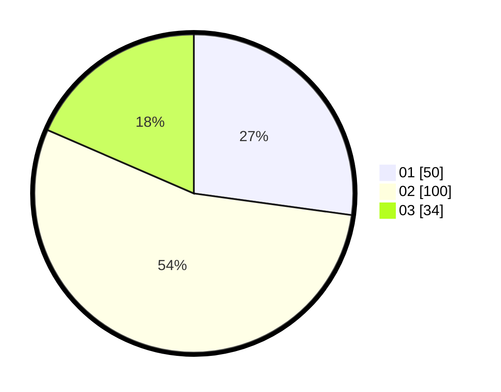

# Hasil

Hasil perolehan suara paslon dapat dilihat pada file paslon-01.txt, paslon-02.txt, dan paslon-03.txt.

Jika tidak ada, artinya data tersebut belum ada pada SIREKAP.

## Perolehan Suara

 * Paslon 01: **50**.
 * Paslon 02: **100**.
 * Paslon 03: **34**.

## Foto C Plano

https://sirekap-obj-formc.kpu.go.id/283c/pemilu/ppwp/31/75/03/10/08/3175031008145-20240214-211300--f5b024b4-b95e-4eea-8b0e-762754190cf5.jpg

https://sirekap-obj-formc.kpu.go.id/283c/pemilu/ppwp/31/75/03/10/08/3175031008145-20240214-211529--c06c10dd-8427-4d27-8d04-a210b77e9a90.jpg

https://sirekap-obj-formc.kpu.go.id/283c/pemilu/ppwp/31/75/03/10/08/3175031008145-20240214-232223--8769f719-bcfc-467c-b4eb-0d8fd5986789.jpg
