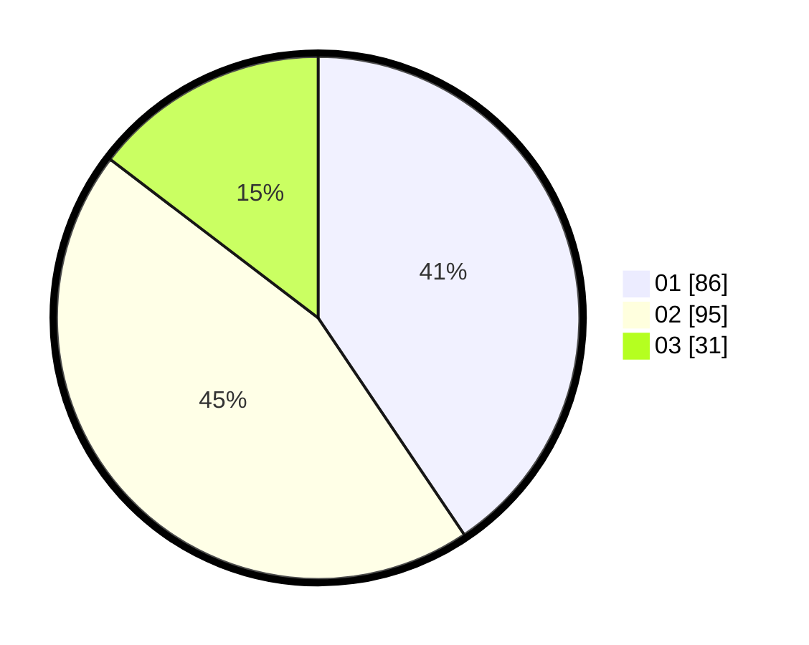

# Hasil

Hasil perolehan suara paslon dapat dilihat pada file paslon-01.txt, paslon-02.txt, dan paslon-03.txt.

Jika tidak ada, artinya data tersebut belum ada pada SIREKAP.

## Perolehan Suara

 * Paslon 01: **86**.
 * Paslon 02: **95**.
 * Paslon 03: **31**.

## Foto C Plano

https://sirekap-obj-formc.kpu.go.id/fb80/pemilu/ppwp/31/75/03/10/08/3175031008146-20240214-192144--57d7cf81-cbe6-477d-9c84-a5b4fc5dd749.jpg

https://sirekap-obj-formc.kpu.go.id/fb80/pemilu/ppwp/31/75/03/10/08/3175031008146-20240214-195238--fdf702ae-d87f-4a59-aa14-321188a85af4.jpg

https://sirekap-obj-formc.kpu.go.id/fb80/pemilu/ppwp/31/75/03/10/08/3175031008146-20240214-193458--bf365ef8-ba91-4dd1-8472-1cefc28d8896.jpg

## DATA PEMILIH TETAP

Jumlah pemilih dalam DPT: **285**.
 * L: **135**.
 * P: **150**.

## DATA PENGGUNA HAK PILIH

Jumlah pengguna hak pilih dalam DPT: **298**.
 * L: **592**.
 * P: **158**.

Jumlah pengguna hak pilih dalam DPTb: **3**.
 * L: **0**.
 * P: **3**.

Jumlah pengguna hak pilih dalam DPK: **1**.
 * L: **0**.
 * P: **6**.

Jumlah pengguna hak pilih: **214**.
 * L: **92**.
 * P: **122**.

## JUMLAH SUARA SAH DAN TIDAK SAH

JUMLAH SELURUH SUARA SAH: **212**.

JUMLAH SUARA TIDAK SAH: **2**.

JUMLAH SELURUH SUARA SAH DAN SUARA TIDAK SAH: **214**.
