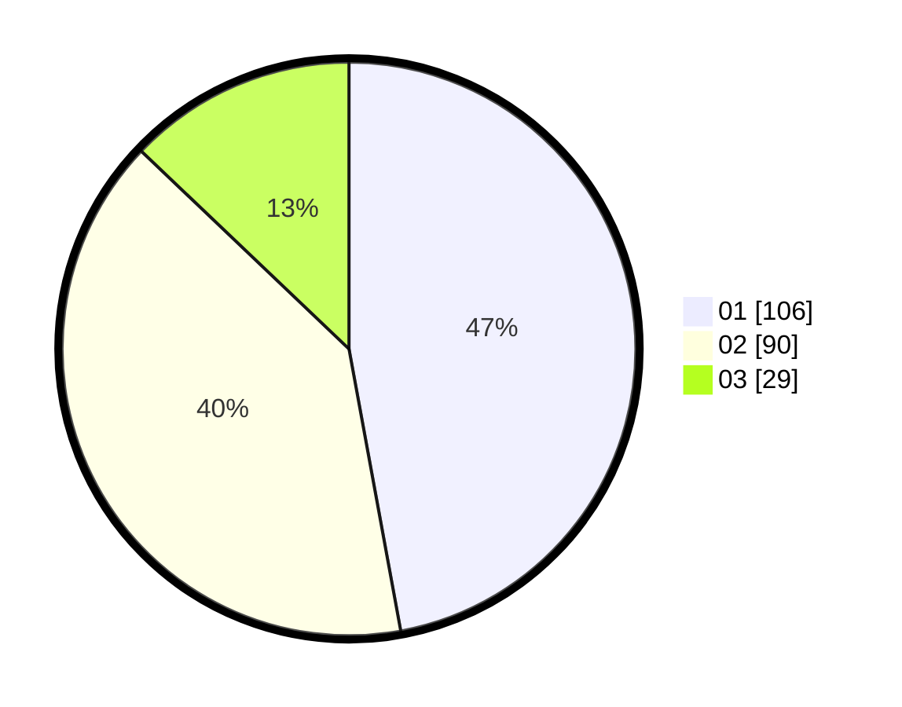

# Hasil

Hasil perolehan suara paslon dapat dilihat pada file paslon-01.txt, paslon-02.txt, dan paslon-03.txt.

Jika tidak ada, artinya data tersebut belum ada pada SIREKAP.

## Perolehan Suara

 * Paslon 01: **106**.
 * Paslon 02: **90**.
 * Paslon 03: **29**.

## Foto C Plano

https://sirekap-obj-formc.kpu.go.id/3576/pemilu/ppwp/31/75/03/10/08/3175031008147-20240214-191731--22762021-0715-4f4f-bf2e-3ab43368b83d.jpg

https://sirekap-obj-formc.kpu.go.id/3576/pemilu/ppwp/31/75/03/10/08/3175031008147-20240214-192303--b56a3064-0240-46c7-a593-c4d5692e3792.jpg

https://sirekap-obj-formc.kpu.go.id/3576/pemilu/ppwp/31/75/03/10/08/3175031008147-20240214-192443--5e197bf2-85ad-4e00-acf5-f8e49d964567.jpg

## DATA PEMILIH TETAP

Jumlah pemilih dalam DPT: **283**.
 * L: **143**.
 * P: **140**.

## DATA PENGGUNA HAK PILIH

Jumlah pengguna hak pilih dalam DPT: **227**.
 * L: **99**.
 * P: **119**.

Jumlah pengguna hak pilih dalam DPTb: **4**.
 * L: **3**.
 * P: **1**.

Jumlah pengguna hak pilih dalam DPK: **5**.
 * L: **3**.
 * P: **2**.

Jumlah pengguna hak pilih: **236**.
 * L: **105**.
 * P: **122**.

## JUMLAH SUARA SAH DAN TIDAK SAH

JUMLAH SELURUH SUARA SAH: **225**.

JUMLAH SUARA TIDAK SAH: **2**.

JUMLAH SELURUH SUARA SAH DAN SUARA TIDAK SAH: **227**.
