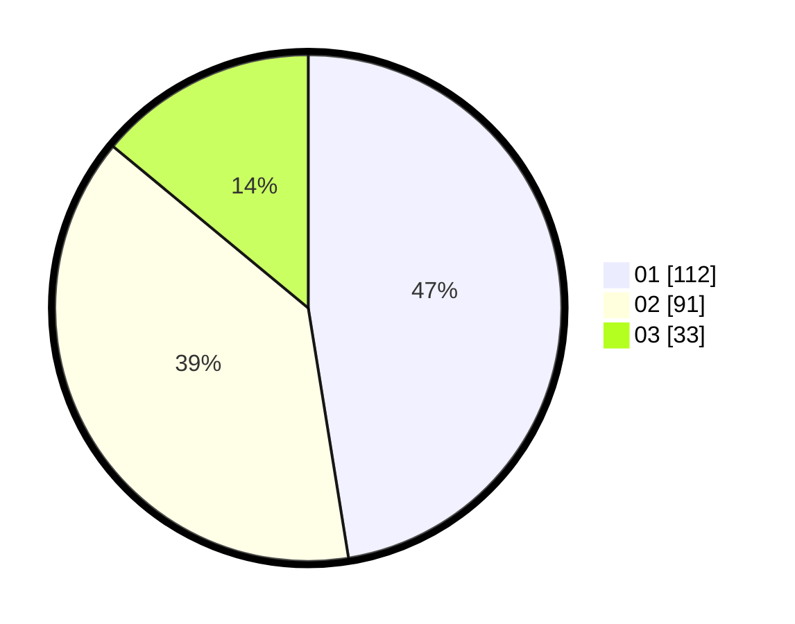

# Hasil

Hasil perolehan suara paslon dapat dilihat pada file paslon-01.txt, paslon-02.txt, dan paslon-03.txt.

Jika tidak ada, artinya data tersebut belum ada pada SIREKAP.

## Perolehan Suara

 * Paslon 01: **112**.
 * Paslon 02: **91**.
 * Paslon 03: **33**.

## Foto C Plano

https://sirekap-obj-formc.kpu.go.id/87ff/pemilu/ppwp/31/75/03/10/08/3175031008149-20240214-190513--bd72805c-cbf7-4a2e-b962-ca88003e7b3f.jpg

https://sirekap-obj-formc.kpu.go.id/87ff/pemilu/ppwp/31/75/03/10/08/3175031008149-20240214-231731--1b2eb104-755d-4a62-bcf3-103ce185ec3a.jpg

https://sirekap-obj-formc.kpu.go.id/87ff/pemilu/ppwp/31/75/03/10/08/3175031008149-20240214-190520--1f3e9c12-247e-42dd-847e-8aa8f79aaf68.jpg

## DATA PEMILIH TETAP

Jumlah pemilih dalam DPT: **284**.
 * L: **135**.
 * P: **149**.

## DATA PENGGUNA HAK PILIH

Jumlah pengguna hak pilih dalam DPT: **234**.
 * L: **102**.
 * P: **132**.

Jumlah pengguna hak pilih dalam DPTb: **6**.
 * L: **3**.
 * P: **3**.

Jumlah pengguna hak pilih dalam DPK: **0**.
 * L: **0**.
 * P: **0**.

Jumlah pengguna hak pilih: **240**.
 * L: **105**.
 * P: **135**.

## JUMLAH SUARA SAH DAN TIDAK SAH

JUMLAH SELURUH SUARA SAH: **236**.

JUMLAH SUARA TIDAK SAH: **4**.

JUMLAH SELURUH SUARA SAH DAN SUARA TIDAK SAH: **240**.
