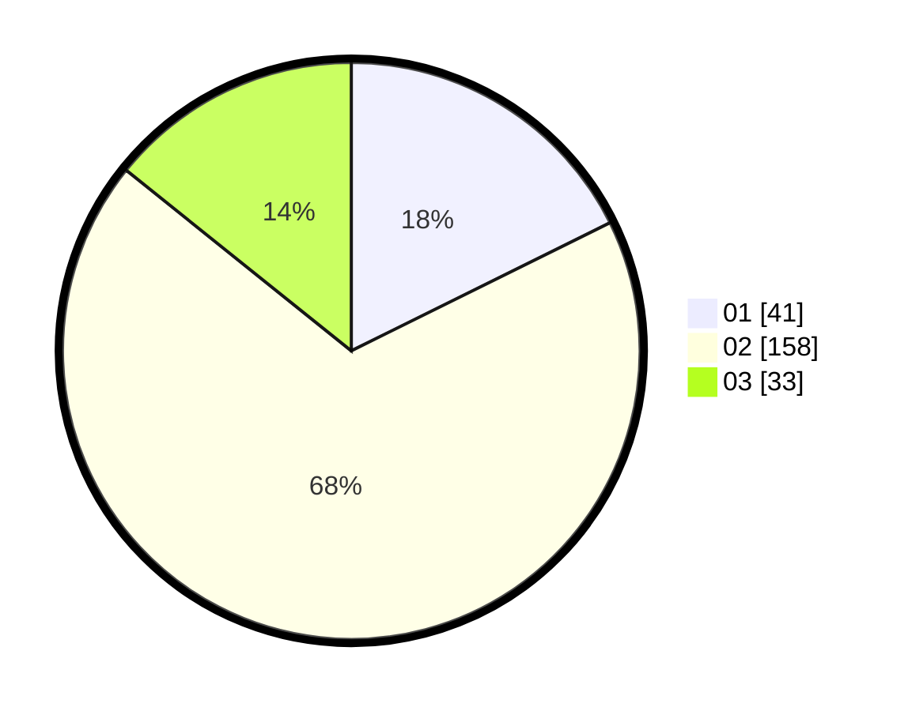

# Hasil

Hasil perolehan suara paslon dapat dilihat pada file paslon-01.txt, paslon-02.txt, dan paslon-03.txt.

Jika tidak ada, artinya data tersebut belum ada pada SIREKAP.

## Perolehan Suara

 * Paslon 01: **41**.
 * Paslon 02: **158**.
 * Paslon 03: **33**.

## Foto C Plano

https://sirekap-obj-formc.kpu.go.id/e577/pemilu/ppwp/31/75/03/10/08/3175031008901-20240214-205450--65c91615-3ee2-4f25-8680-cc752fa574c7.jpg

https://sirekap-obj-formc.kpu.go.id/e577/pemilu/ppwp/31/75/03/10/08/3175031008901-20240214-223442--9ef4e607-64dc-4d59-91a5-f6a996a19cc9.jpg

https://sirekap-obj-formc.kpu.go.id/e577/pemilu/ppwp/31/75/03/10/08/3175031008901-20240214-223733--b897019e-3f60-4b8c-b818-9c833442830b.jpg
