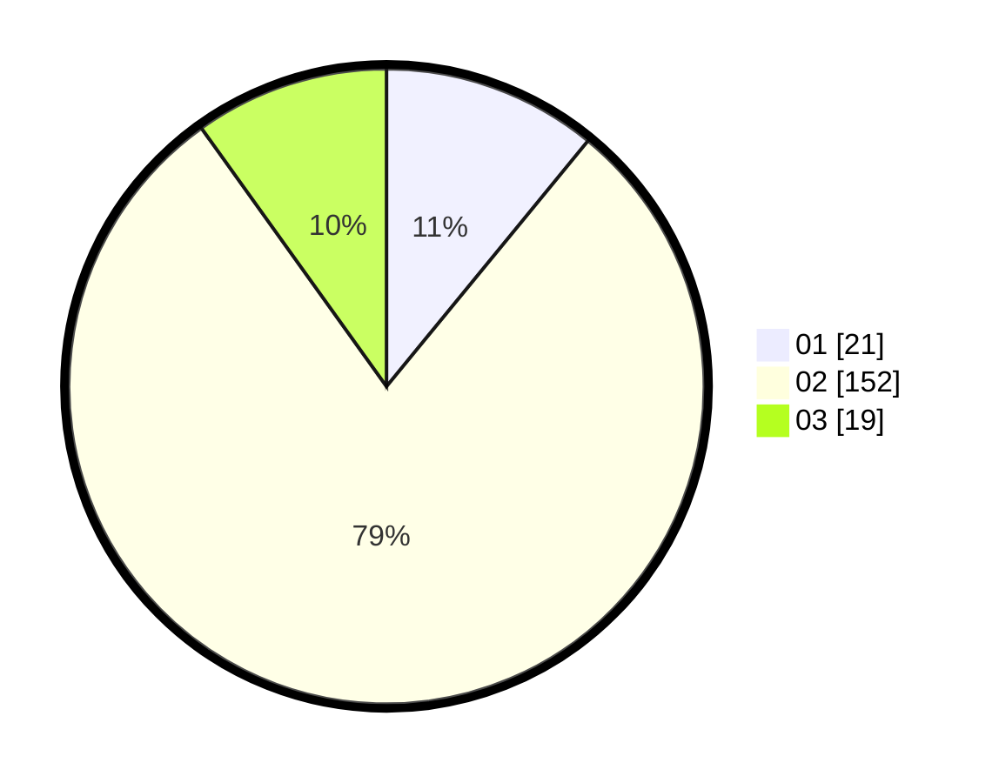

# Hasil

Hasil perolehan suara paslon dapat dilihat pada file paslon-01.txt, paslon-02.txt, dan paslon-03.txt.

Jika tidak ada, artinya data tersebut belum ada pada SIREKAP.

## Perolehan Suara

 * Paslon 01: **21**.
 * Paslon 02: **152**.
 * Paslon 03: **19**.

## Foto C Plano

https://sirekap-obj-formc.kpu.go.id/ffe9/pemilu/ppwp/31/75/03/10/08/3175031008908-20240214-204841--4bc502bd-4783-4c4b-a285-57691568317a.jpg

https://sirekap-obj-formc.kpu.go.id/ffe9/pemilu/ppwp/31/75/03/10/08/3175031008908-20240214-194716--56db9fa5-f9c8-415d-b4f5-e0c59ba31b22.jpg

https://sirekap-obj-formc.kpu.go.id/ffe9/pemilu/ppwp/31/75/03/10/08/3175031008908-20240214-201025--df4e3115-79a1-48f3-a462-759e89262a8a.jpg

## DATA PEMILIH TETAP

Jumlah pemilih dalam DPT: **171**.
 * L: **171**.
 * P: **0**.

## DATA PENGGUNA HAK PILIH

Jumlah pengguna hak pilih dalam DPT: **171**.
 * L: **171**.
 * P: **0**.

Jumlah pengguna hak pilih dalam DPTb: **26**.
 * L: **24**.
 * P: **2**.

Jumlah pengguna hak pilih dalam DPK: **0**.
 * L: **0**.
 * P: **0**.

Jumlah pengguna hak pilih: **197**.
 * L: **195**.
 * P: **2**.

## JUMLAH SUARA SAH DAN TIDAK SAH

JUMLAH SELURUH SUARA SAH: **177**.

JUMLAH SUARA TIDAK SAH: **5**.

JUMLAH SELURUH SUARA SAH DAN SUARA TIDAK SAH: **197**.
