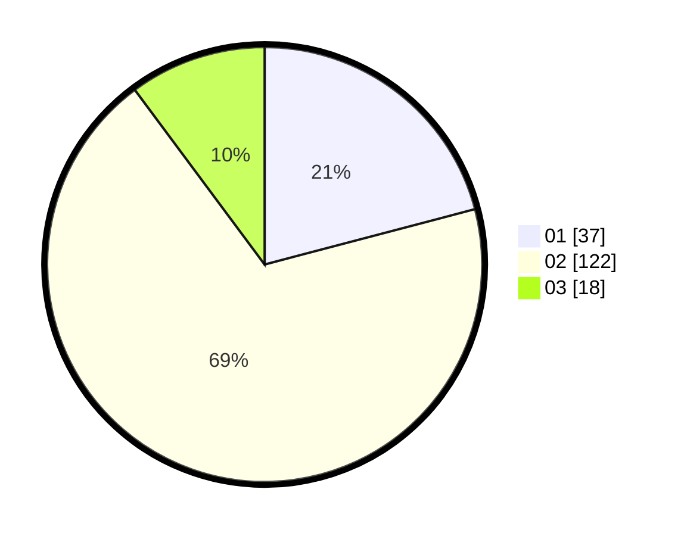

# Hasil

Hasil perolehan suara paslon dapat dilihat pada file paslon-01.txt, paslon-02.txt, dan paslon-03.txt.

Jika tidak ada, artinya data tersebut belum ada pada SIREKAP.

## Perolehan Suara

 * Paslon 01: **37**.
 * Paslon 02: **122**.
 * Paslon 03: **18**.

## Foto C Plano

https://sirekap-obj-formc.kpu.go.id/f721/pemilu/ppwp/31/75/03/10/08/3175031008912-20240214-214500--525c658b-b52c-460c-8c45-665ae081cdc6.jpg

https://sirekap-obj-formc.kpu.go.id/f721/pemilu/ppwp/31/75/03/10/08/3175031008912-20240214-214752--61845d3b-6c7d-46c7-96fb-3b445b219a32.jpg

https://sirekap-obj-formc.kpu.go.id/f721/pemilu/ppwp/31/75/03/10/08/3175031008912-20240214-203547--285ae6ba-24e2-4f71-acfa-14048db786fa.jpg

## DATA PEMILIH TETAP

Jumlah pemilih dalam DPT: **213**.
 * L: **213**.
 * P: **0**.

## DATA PENGGUNA HAK PILIH

Jumlah pengguna hak pilih dalam DPT: **213**.
 * L: **213**.
 * P: **0**.

Jumlah pengguna hak pilih dalam DPTb: **37**.
 * L: **35**.
 * P: **2**.

Jumlah pengguna hak pilih dalam DPK: **0**.
 * L: **0**.
 * P: **0**.

Jumlah pengguna hak pilih: **250**.
 * L: **248**.
 * P: **2**.

## JUMLAH SUARA SAH DAN TIDAK SAH

JUMLAH SELURUH SUARA SAH: **177**.

JUMLAH SUARA TIDAK SAH: **0**.

JUMLAH SELURUH SUARA SAH DAN SUARA TIDAK SAH: **177**.
