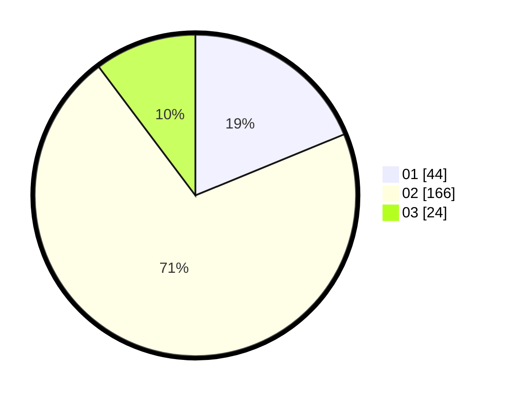

# Hasil

Hasil perolehan suara paslon dapat dilihat pada file paslon-01.txt, paslon-02.txt, dan paslon-03.txt.

Jika tidak ada, artinya data tersebut belum ada pada SIREKAP.

## Perolehan Suara

 * Paslon 01: **44**.
 * Paslon 02: **166**.
 * Paslon 03: **24**.

## Foto C Plano

https://sirekap-obj-formc.kpu.go.id/8861/pemilu/ppwp/31/75/03/10/08/3175031008916-20240214-200842--f82d5908-85f9-4847-8592-81a06b9ab192.jpg

https://sirekap-obj-formc.kpu.go.id/8861/pemilu/ppwp/31/75/03/10/08/3175031008916-20240214-200859--20bd0521-9a12-4035-868a-e6f26bcbd101.jpg

https://sirekap-obj-formc.kpu.go.id/8861/pemilu/ppwp/31/75/03/10/08/3175031008916-20240214-200907--ea933a3c-f9d4-4a8c-8a83-adfbfa7440e6.jpg

## DATA PEMILIH TETAP

Jumlah pemilih dalam DPT: **285**.
 * L: **285**.
 * P: **0**.

## DATA PENGGUNA HAK PILIH

Jumlah pengguna hak pilih dalam DPT: **137**.
 * L: **137**.
 * P: **0**.

Jumlah pengguna hak pilih dalam DPTb: **102**.
 * L: **102**.
 * P: **0**.

Jumlah pengguna hak pilih dalam DPK: **1**.
 * L: **1**.
 * P: **0**.

Jumlah pengguna hak pilih: **240**.
 * L: **240**.
 * P: **0**.

## JUMLAH SUARA SAH DAN TIDAK SAH

JUMLAH SELURUH SUARA SAH: **234**.

JUMLAH SUARA TIDAK SAH: **6**.

JUMLAH SELURUH SUARA SAH DAN SUARA TIDAK SAH: **240**.
