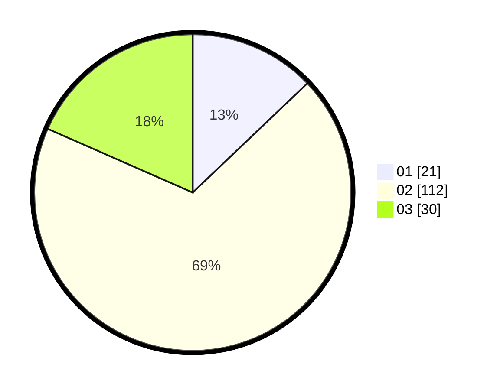

# Hasil

Hasil perolehan suara paslon dapat dilihat pada file paslon-01.txt, paslon-02.txt, dan paslon-03.txt.

Jika tidak ada, artinya data tersebut belum ada pada SIREKAP.

## Perolehan Suara

 * Paslon 01: **21**.
 * Paslon 02: **112**.
 * Paslon 03: **30**.

## Foto C Plano

https://sirekap-obj-formc.kpu.go.id/f021/pemilu/ppwp/31/75/03/10/08/3175031008919-20240214-155500--67280ff4-d933-4ebd-a7f2-951e319b8277.jpg

https://sirekap-obj-formc.kpu.go.id/f021/pemilu/ppwp/31/75/03/10/08/3175031008919-20240214-155634--10a1c306-acce-4851-ba67-299f837eb141.jpg

https://sirekap-obj-formc.kpu.go.id/f021/pemilu/ppwp/31/75/03/10/08/3175031008919-20240214-155802--b71a3973-da61-4897-a47c-eccb602e7440.jpg

## DATA PEMILIH TETAP

Jumlah pemilih dalam DPT: **275**.
 * L: **275**.
 * P: **0**.

## DATA PENGGUNA HAK PILIH

Jumlah pengguna hak pilih dalam DPT: **130**.
 * L: **130**.
 * P: **0**.

Jumlah pengguna hak pilih dalam DPTb: **36**.
 * L: **36**.
 * P: **0**.

Jumlah pengguna hak pilih dalam DPK: **0**.
 * L: **0**.
 * P: **0**.

Jumlah pengguna hak pilih: **166**.
 * L: **166**.
 * P: **0**.

## JUMLAH SUARA SAH DAN TIDAK SAH

JUMLAH SELURUH SUARA SAH: **163**.

JUMLAH SUARA TIDAK SAH: **3**.

JUMLAH SELURUH SUARA SAH DAN SUARA TIDAK SAH: **166**.
