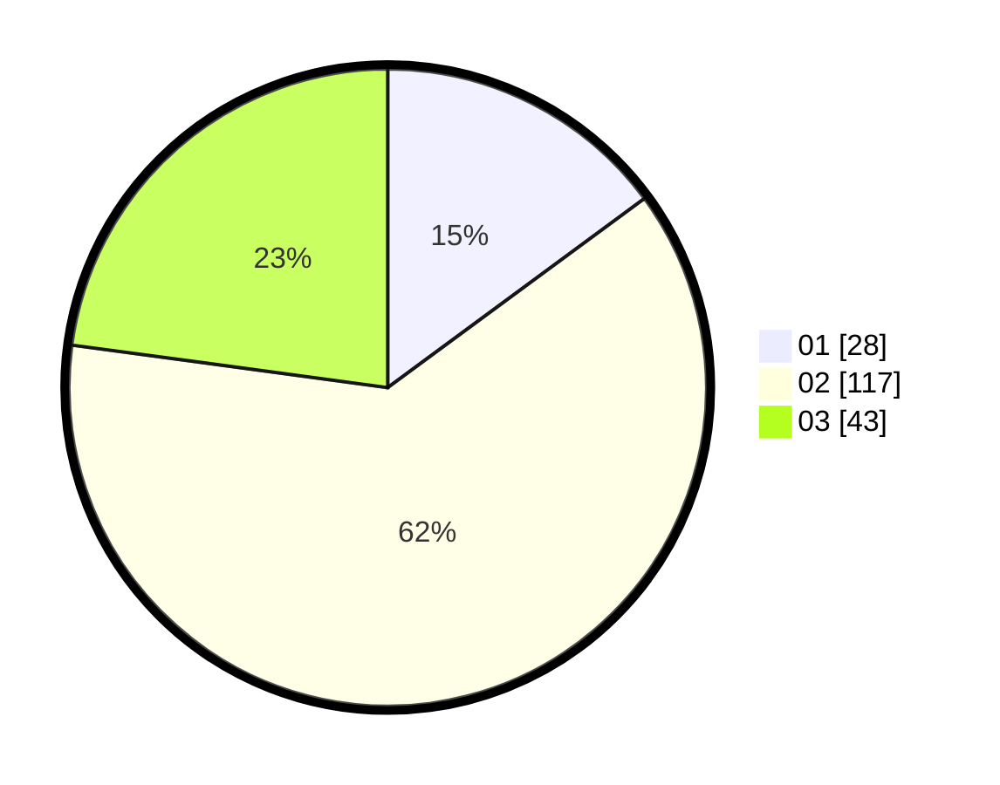

# Hasil

Hasil perolehan suara paslon dapat dilihat pada file paslon-01.txt, paslon-02.txt, dan paslon-03.txt.

Jika tidak ada, artinya data tersebut belum ada pada SIREKAP.

## Perolehan Suara

 * Paslon 01: **28**.
 * Paslon 02: **117**.
 * Paslon 03: **43**.

## Foto C Plano

https://sirekap-obj-formc.kpu.go.id/0cfc/pemilu/ppwp/31/75/03/10/08/3175031008920-20240214-190719--f22ff5c5-4ea5-47e5-84b0-6c1b43b9858b.jpg

https://sirekap-obj-formc.kpu.go.id/0cfc/pemilu/ppwp/31/75/03/10/08/3175031008920-20240214-190723--70a78706-bdc3-4d37-9242-a0952d412725.jpg

https://sirekap-obj-formc.kpu.go.id/0cfc/pemilu/ppwp/31/75/03/10/08/3175031008920-20240214-193403--eb2096ba-6507-48eb-90e4-6096fe6e09ad.jpg

## DATA PEMILIH TETAP

Jumlah pemilih dalam DPT: **268**.
 * L: **268**.
 * P: **0**.

## DATA PENGGUNA HAK PILIH

Jumlah pengguna hak pilih dalam DPT: **178**.
 * L: **178**.
 * P: **0**.

Jumlah pengguna hak pilih dalam DPTb: **13**.
 * L: **13**.
 * P: **0**.

Jumlah pengguna hak pilih dalam DPK: **0**.
 * L: **0**.
 * P: **0**.

Jumlah pengguna hak pilih: **191**.
 * L: **191**.
 * P: **0**.

## JUMLAH SUARA SAH DAN TIDAK SAH

JUMLAH SELURUH SUARA SAH: **188**.

JUMLAH SUARA TIDAK SAH: **3**.

JUMLAH SELURUH SUARA SAH DAN SUARA TIDAK SAH: **191**.
