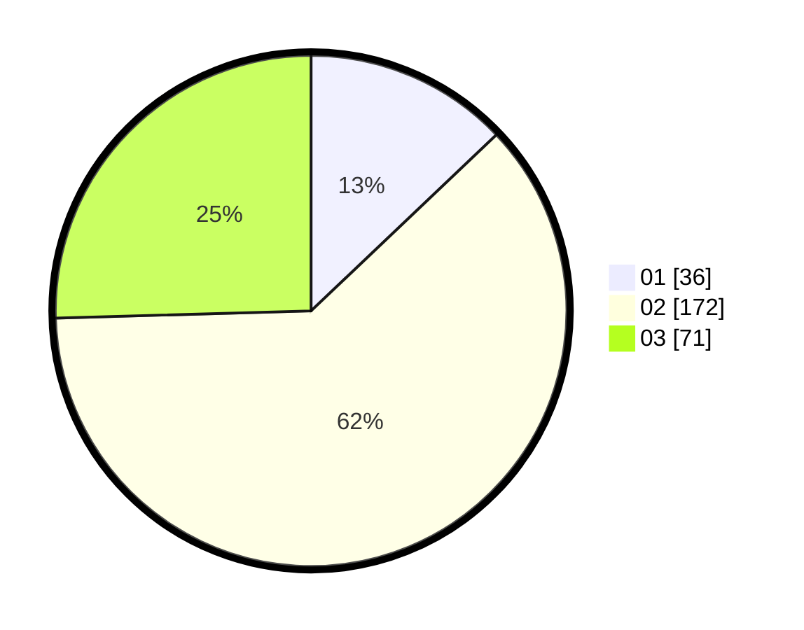

# Hasil

Hasil perolehan suara paslon dapat dilihat pada file paslon-01.txt, paslon-02.txt, dan paslon-03.txt.

Jika tidak ada, artinya data tersebut belum ada pada SIREKAP.

## Perolehan Suara

 * Paslon 01: **36**.
 * Paslon 02: **172**.
 * Paslon 03: **71**.

## Foto C Plano

https://sirekap-obj-formc.kpu.go.id/df9a/pemilu/ppwp/31/75/03/10/08/3175031008925-20240219-163302--2d7379d9-3a08-4a93-87ab-e14d7cc09cb4.jpg

https://sirekap-obj-formc.kpu.go.id/df9a/pemilu/ppwp/31/75/03/10/08/3175031008925-20240219-163303--f8b88952-683f-4440-8159-d6e6dbe0fe11.jpg

https://sirekap-obj-formc.kpu.go.id/df9a/pemilu/ppwp/31/75/03/10/08/3175031008925-20240219-163303--4ee457d9-405f-4fd3-9940-33dbd281abbe.jpg

## DATA PEMILIH TETAP

Jumlah pemilih dalam DPT: **96**.
 * L: **96**.
 * P: **0**.

## DATA PENGGUNA HAK PILIH

Jumlah pengguna hak pilih dalam DPT: **81**.
 * L: **81**.
 * P: **0**.

Jumlah pengguna hak pilih dalam DPTb: **214**.
 * L: **210**.
 * P: **4**.

Jumlah pengguna hak pilih dalam DPK: **0**.
 * L: **0**.
 * P: **0**.

Jumlah pengguna hak pilih: **295**.
 * L: **291**.
 * P: **4**.

## JUMLAH SUARA SAH DAN TIDAK SAH

JUMLAH SELURUH SUARA SAH: **279**.

JUMLAH SUARA TIDAK SAH: **16**.

JUMLAH SELURUH SUARA SAH DAN SUARA TIDAK SAH: **295**.
