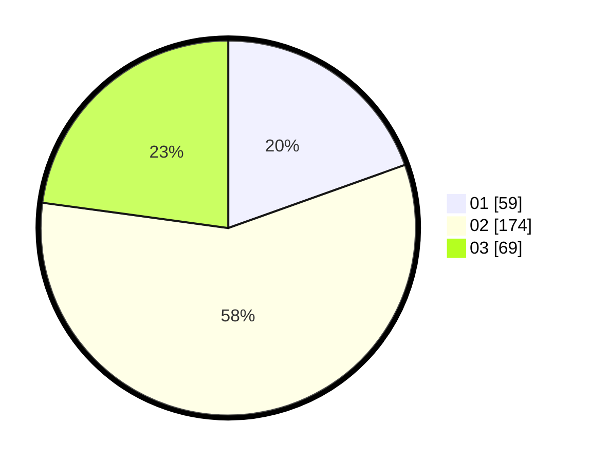

# Hasil

Hasil perolehan suara paslon dapat dilihat pada file paslon-01.txt, paslon-02.txt, dan paslon-03.txt.

Jika tidak ada, artinya data tersebut belum ada pada SIREKAP.

## Perolehan Suara

 * Paslon 01: **59**.
 * Paslon 02: **174**.
 * Paslon 03: **69**.

## Foto C Plano

https://sirekap-obj-formc.kpu.go.id/7bd2/pemilu/ppwp/31/75/03/10/08/3175031008926-20240219-163122--8c512ec8-254a-4974-8d39-dc893533b185.jpg

https://sirekap-obj-formc.kpu.go.id/7bd2/pemilu/ppwp/31/75/03/10/08/3175031008926-20240219-163124--bce30b4c-3f05-4b5e-9c28-7fcf0c2b24e7.jpg

https://sirekap-obj-formc.kpu.go.id/7bd2/pemilu/ppwp/31/75/03/10/08/3175031008926-20240219-163123--db99e18d-a973-4446-a6c9-a3cf2398e282.jpg

## DATA PEMILIH TETAP

Jumlah pemilih dalam DPT: **103**.
 * L: **103**.
 * P: **0**.

## DATA PENGGUNA HAK PILIH

Jumlah pengguna hak pilih dalam DPT: **80**.
 * L: **80**.
 * P: **0**.

Jumlah pengguna hak pilih dalam DPTb: **227**.
 * L: **226**.
 * P: **1**.

Jumlah pengguna hak pilih dalam DPK: **0**.
 * L: **0**.
 * P: **0**.

Jumlah pengguna hak pilih: **307**.
 * L: **306**.
 * P: **1**.

## JUMLAH SUARA SAH DAN TIDAK SAH

JUMLAH SELURUH SUARA SAH: **302**.

JUMLAH SUARA TIDAK SAH: **5**.

JUMLAH SELURUH SUARA SAH DAN SUARA TIDAK SAH: **307**.
