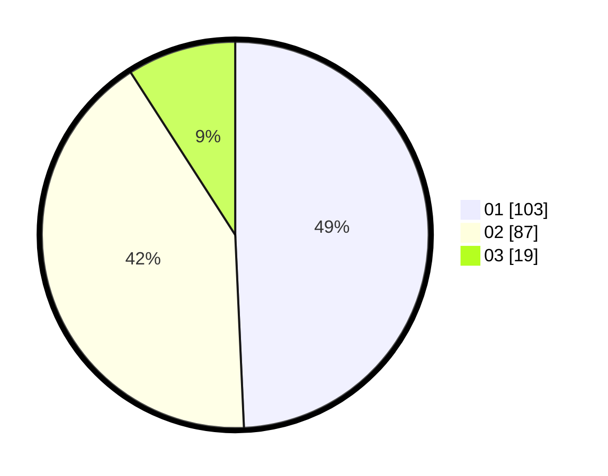

# Hasil

Hasil perolehan suara paslon dapat dilihat pada file paslon-01.txt, paslon-02.txt, dan paslon-03.txt.

Jika tidak ada, artinya data tersebut belum ada pada SIREKAP.

## Perolehan Suara

 * Paslon 01: **103**.
 * Paslon 02: **87**.
 * Paslon 03: **19**.

## Foto C Plano

https://sirekap-obj-formc.kpu.go.id/21e2/pemilu/ppwp/31/75/04/10/01/3175041001001-20240218-185829--22b0b86e-3277-4f77-9619-bec4c8648a49.jpg

https://sirekap-obj-formc.kpu.go.id/21e2/pemilu/ppwp/31/75/04/10/01/3175041001001-20240218-190143--b7c70d5c-7865-49ed-9aaa-f786cdcf10d2.jpg

https://sirekap-obj-formc.kpu.go.id/21e2/pemilu/ppwp/31/75/04/10/01/3175041001001-20240218-190555--bf8e2bfc-909e-4bea-8f83-3df8e65517ce.jpg

## DATA PEMILIH TETAP

Jumlah pemilih dalam DPT: **279**.
 * L: **137**.
 * P: **142**.

## DATA PENGGUNA HAK PILIH

Jumlah pengguna hak pilih dalam DPT: **204**.
 * L: **95**.
 * P: **109**.

Jumlah pengguna hak pilih dalam DPTb: **2**.
 * L: **0**.
 * P: **2**.

Jumlah pengguna hak pilih dalam DPK: **6**.
 * L: **3**.
 * P: **3**.

Jumlah pengguna hak pilih: **212**.
 * L: **98**.
 * P: **114**.

## JUMLAH SUARA SAH DAN TIDAK SAH

JUMLAH SELURUH SUARA SAH: **209**.

JUMLAH SUARA TIDAK SAH: **3**.

JUMLAH SELURUH SUARA SAH DAN SUARA TIDAK SAH: **212**.
