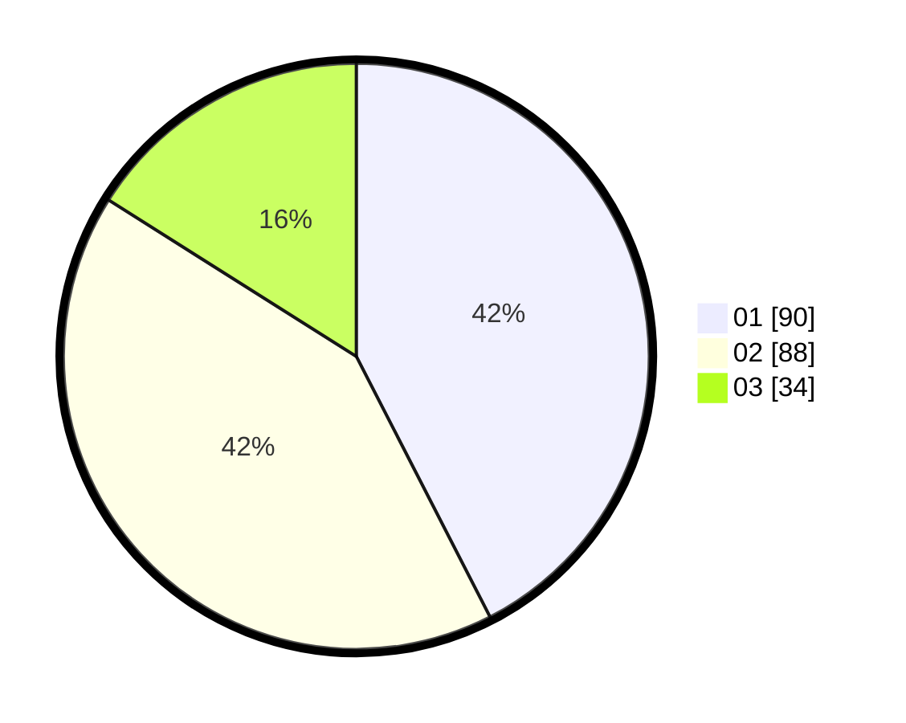

# Hasil

Hasil perolehan suara paslon dapat dilihat pada file paslon-01.txt, paslon-02.txt, dan paslon-03.txt.

Jika tidak ada, artinya data tersebut belum ada pada SIREKAP.

## Perolehan Suara

 * Paslon 01: **90**.
 * Paslon 02: **88**.
 * Paslon 03: **34**.

## Foto C Plano

https://sirekap-obj-formc.kpu.go.id/3520/pemilu/ppwp/31/75/04/10/01/3175041001002-20240217-181622--e3e61626-ee9c-416d-8d2b-aae919504353.jpg

https://sirekap-obj-formc.kpu.go.id/3520/pemilu/ppwp/31/75/04/10/01/3175041001002-20240217-181713--0cb97a66-919a-45fc-a4a2-ef6bacc4ba53.jpg

https://sirekap-obj-formc.kpu.go.id/3520/pemilu/ppwp/31/75/04/10/01/3175041001002-20240217-181751--d27054f3-9b8b-4216-99b5-604bfa98cdf9.jpg

## DATA PEMILIH TETAP

Jumlah pemilih dalam DPT: **283**.
 * L: **136**.
 * P: **147**.

## DATA PENGGUNA HAK PILIH

Jumlah pengguna hak pilih dalam DPT: **210**.
 * L: **93**.
 * P: **117**.

Jumlah pengguna hak pilih dalam DPTb: **0**.
 * L: **0**.
 * P: **0**.

Jumlah pengguna hak pilih dalam DPK: **4**.
 * L: **2**.
 * P: **2**.

Jumlah pengguna hak pilih: **214**.
 * L: **95**.
 * P: **119**.

## JUMLAH SUARA SAH DAN TIDAK SAH

JUMLAH SELURUH SUARA SAH: **212**.

JUMLAH SUARA TIDAK SAH: **2**.

JUMLAH SELURUH SUARA SAH DAN SUARA TIDAK SAH: **214**.
