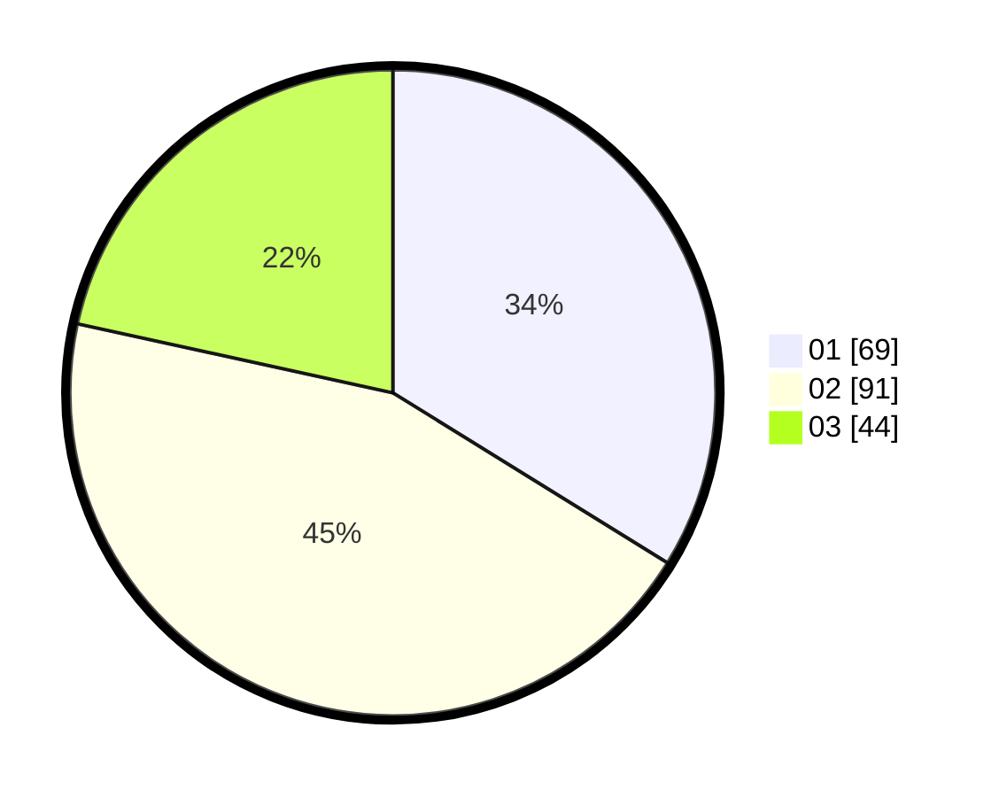

# Hasil

Hasil perolehan suara paslon dapat dilihat pada file paslon-01.txt, paslon-02.txt, dan paslon-03.txt.

Jika tidak ada, artinya data tersebut belum ada pada SIREKAP.

## Perolehan Suara

 * Paslon 01: **69**.
 * Paslon 02: **91**.
 * Paslon 03: **44**.

## Foto C Plano

https://sirekap-obj-formc.kpu.go.id/f32d/pemilu/ppwp/31/75/04/10/01/3175041001005-20240217-210803--15e79b25-4dac-4740-973f-21a67afbcaa4.jpg

https://sirekap-obj-formc.kpu.go.id/f32d/pemilu/ppwp/31/75/04/10/01/3175041001005-20240217-202047--d2953e38-a74b-4584-aac1-11dd5d2b2ab1.jpg

https://sirekap-obj-formc.kpu.go.id/f32d/pemilu/ppwp/31/75/04/10/01/3175041001005-20240217-202239--8add3df8-ef51-43e9-a9c3-2d93d20e75fd.jpg

## DATA PEMILIH TETAP

Jumlah pemilih dalam DPT: **259**.
 * L: **130**.
 * P: **129**.

## DATA PENGGUNA HAK PILIH

Jumlah pengguna hak pilih dalam DPT: **203**.
 * L: **99**.
 * P: **104**.

Jumlah pengguna hak pilih dalam DPTb: **0**.
 * L: **0**.
 * P: **0**.

Jumlah pengguna hak pilih dalam DPK: **2**.
 * L: **2**.
 * P: **0**.

Jumlah pengguna hak pilih: **205**.
 * L: **101**.
 * P: **104**.

## JUMLAH SUARA SAH DAN TIDAK SAH

JUMLAH SELURUH SUARA SAH: **204**.

JUMLAH SUARA TIDAK SAH: **1**.

JUMLAH SELURUH SUARA SAH DAN SUARA TIDAK SAH: **205**.
