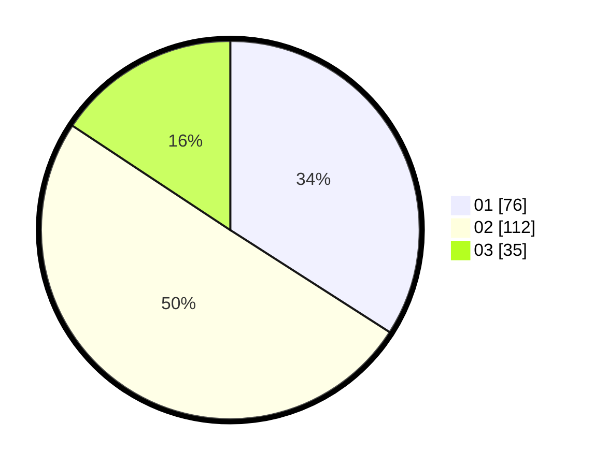

# Hasil

Hasil perolehan suara paslon dapat dilihat pada file paslon-01.txt, paslon-02.txt, dan paslon-03.txt.

Jika tidak ada, artinya data tersebut belum ada pada SIREKAP.

## Perolehan Suara

 * Paslon 01: **76**.
 * Paslon 02: **112**.
 * Paslon 03: **35**.

## Foto C Plano

https://sirekap-obj-formc.kpu.go.id/742f/pemilu/ppwp/31/75/04/10/01/3175041001006-20240218-072248--8b15c486-6378-4fe7-8537-f06156375605.jpg

https://sirekap-obj-formc.kpu.go.id/742f/pemilu/ppwp/31/75/04/10/01/3175041001006-20240217-225557--2572e7ac-31a7-4349-b0d6-cd6c80217cc1.jpg

https://sirekap-obj-formc.kpu.go.id/742f/pemilu/ppwp/31/75/04/10/01/3175041001006-20240218-072539--625c9c8a-3ad5-4e85-a5e4-1d3a18dce08e.jpg

## DATA PEMILIH TETAP

Jumlah pemilih dalam DPT: **279**.
 * L: **124**.
 * P: **155**.

## DATA PENGGUNA HAK PILIH

Jumlah pengguna hak pilih dalam DPT: **225**.
 * L: **96**.
 * P: **129**.

Jumlah pengguna hak pilih dalam DPTb: **0**.
 * L: **0**.
 * P: **0**.

Jumlah pengguna hak pilih dalam DPK: **0**.
 * L: **0**.
 * P: **0**.

Jumlah pengguna hak pilih: **225**.
 * L: **96**.
 * P: **129**.

## JUMLAH SUARA SAH DAN TIDAK SAH

JUMLAH SELURUH SUARA SAH: **223**.

JUMLAH SUARA TIDAK SAH: **2**.

JUMLAH SELURUH SUARA SAH DAN SUARA TIDAK SAH: **225**.
