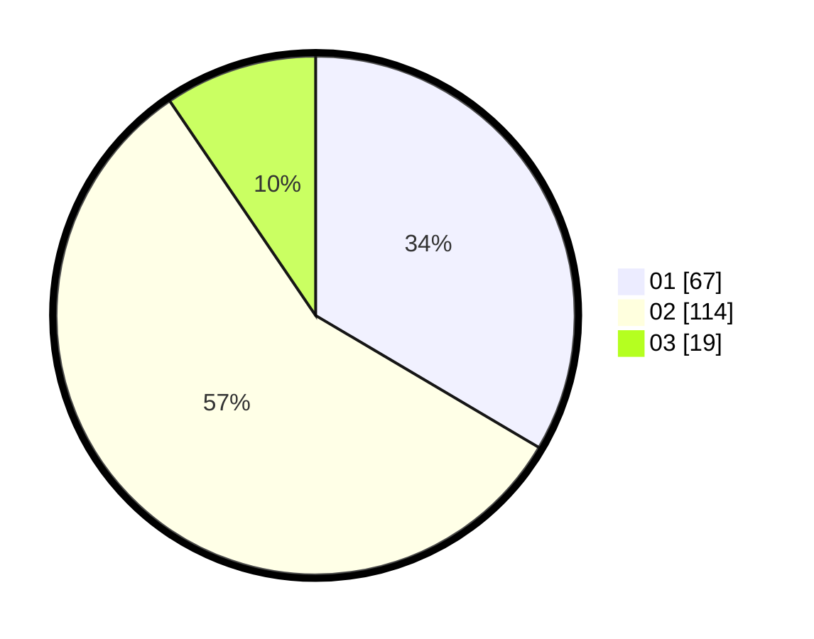

# Hasil

Hasil perolehan suara paslon dapat dilihat pada file paslon-01.txt, paslon-02.txt, dan paslon-03.txt.

Jika tidak ada, artinya data tersebut belum ada pada SIREKAP.

## Perolehan Suara

 * Paslon 01: **67**.
 * Paslon 02: **114**.
 * Paslon 03: **19**.

## Foto C Plano

https://sirekap-obj-formc.kpu.go.id/7f85/pemilu/ppwp/31/75/04/10/01/3175041001016-20240217-174107--78260255-ad38-448c-b4ac-5a5d2f54ca6c.jpg

https://sirekap-obj-formc.kpu.go.id/7f85/pemilu/ppwp/31/75/04/10/01/3175041001016-20240217-174532--eeede077-34a4-4e4a-86b7-871c567ee2e4.jpg

https://sirekap-obj-formc.kpu.go.id/7f85/pemilu/ppwp/31/75/04/10/01/3175041001016-20240217-175423--6fe51160-ae74-424b-b2b7-5d9521005d74.jpg

## DATA PEMILIH TETAP

Jumlah pemilih dalam DPT: **267**.
 * L: **117**.
 * P: **150**.

## DATA PENGGUNA HAK PILIH

Jumlah pengguna hak pilih dalam DPT: **203**.
 * L: **83**.
 * P: **120**.

Jumlah pengguna hak pilih dalam DPTb: **0**.
 * L: **0**.
 * P: **0**.

Jumlah pengguna hak pilih dalam DPK: **1**.
 * L: **1**.
 * P: **0**.

Jumlah pengguna hak pilih: **204**.
 * L: **84**.
 * P: **120**.

## JUMLAH SUARA SAH DAN TIDAK SAH

JUMLAH SELURUH SUARA SAH: **200**.

JUMLAH SUARA TIDAK SAH: **4**.

JUMLAH SELURUH SUARA SAH DAN SUARA TIDAK SAH: **204**.
