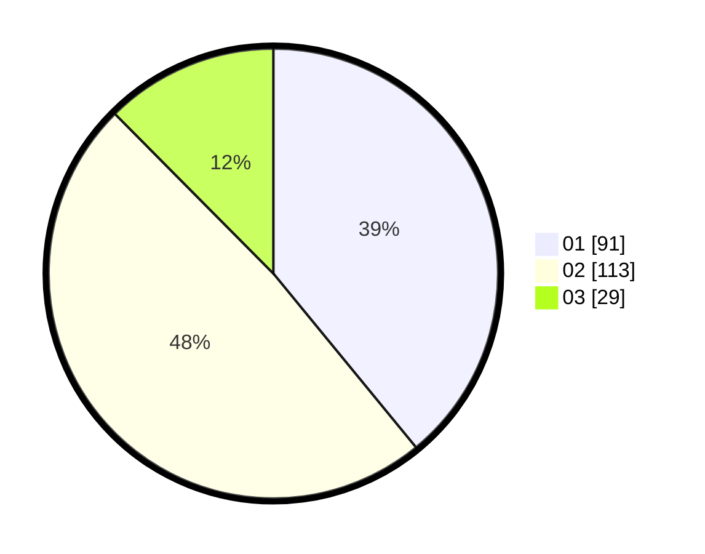

# Hasil

Hasil perolehan suara paslon dapat dilihat pada file paslon-01.txt, paslon-02.txt, dan paslon-03.txt.

Jika tidak ada, artinya data tersebut belum ada pada SIREKAP.

## Perolehan Suara

 * Paslon 01: **91**.
 * Paslon 02: **113**.
 * Paslon 03: **29**.

## Foto C Plano

https://sirekap-obj-formc.kpu.go.id/0fcb/pemilu/ppwp/31/75/04/10/01/3175041001021-20240214-200945--45e26cab-b4e4-47b9-b279-3c6f1a71975d.jpg

https://sirekap-obj-formc.kpu.go.id/0fcb/pemilu/ppwp/31/75/04/10/01/3175041001021-20240214-203310--ac72c178-b6c0-4d40-bdc7-245be067fa46.jpg

https://sirekap-obj-formc.kpu.go.id/0fcb/pemilu/ppwp/31/75/04/10/01/3175041001021-20240214-203448--56045894-ab9f-4143-bbd2-343e5bc20c59.jpg
