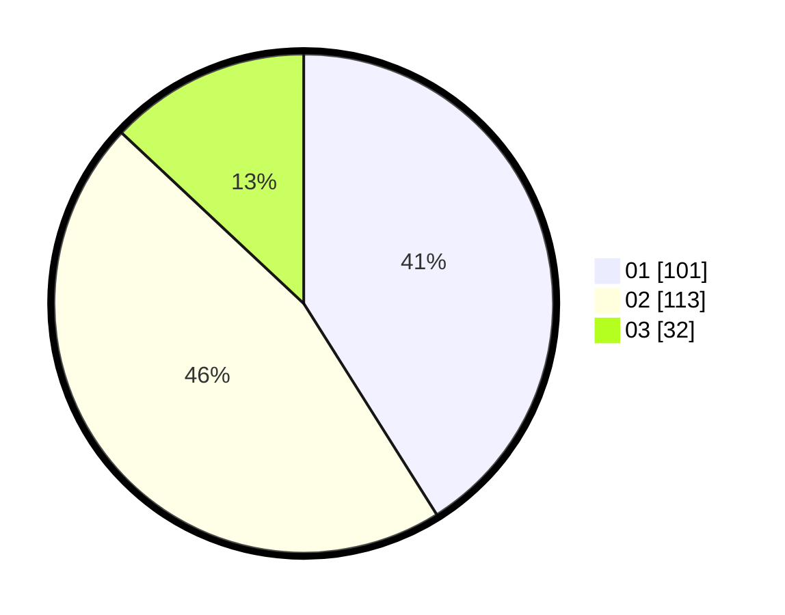

# Hasil

Hasil perolehan suara paslon dapat dilihat pada file paslon-01.txt, paslon-02.txt, dan paslon-03.txt.

Jika tidak ada, artinya data tersebut belum ada pada SIREKAP.

## Perolehan Suara

 * Paslon 01: **101**.
 * Paslon 02: **113**.
 * Paslon 03: **32**.

## Foto C Plano

https://sirekap-obj-formc.kpu.go.id/9ddb/pemilu/ppwp/31/75/04/10/01/3175041001022-20240217-162419--328fa4ba-4cdb-47a0-96e3-e4038696fa15.jpg

https://sirekap-obj-formc.kpu.go.id/9ddb/pemilu/ppwp/31/75/04/10/01/3175041001022-20240217-163312--39bb4342-0f42-468b-b9cd-6ed380a1e453.jpg

https://sirekap-obj-formc.kpu.go.id/9ddb/pemilu/ppwp/31/75/04/10/01/3175041001022-20240217-163610--68e2aa12-fd48-47aa-a5e7-c0e2505883f0.jpg

## DATA PEMILIH TETAP

Jumlah pemilih dalam DPT: **292**.
 * L: **138**.
 * P: **154**.

## DATA PENGGUNA HAK PILIH

Jumlah pengguna hak pilih dalam DPT: **237**.
 * L: **112**.
 * P: **125**.

Jumlah pengguna hak pilih dalam DPTb: **0**.
 * L: **0**.
 * P: **0**.

Jumlah pengguna hak pilih dalam DPK: **12**.
 * L: **8**.
 * P: **4**.

Jumlah pengguna hak pilih: **249**.
 * L: **120**.
 * P: **129**.

## JUMLAH SUARA SAH DAN TIDAK SAH

JUMLAH SELURUH SUARA SAH: **246**.

JUMLAH SUARA TIDAK SAH: **3**.

JUMLAH SELURUH SUARA SAH DAN SUARA TIDAK SAH: **249**.
