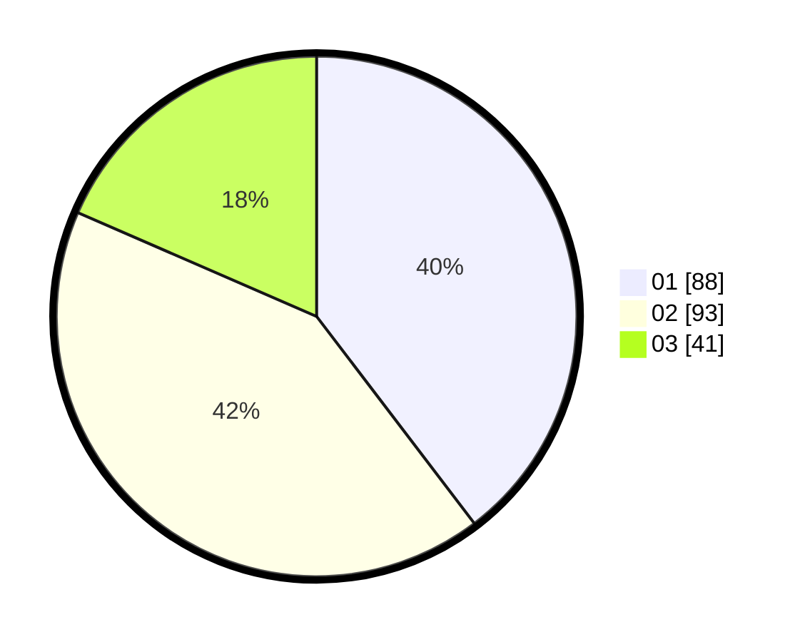

# Hasil

Hasil perolehan suara paslon dapat dilihat pada file paslon-01.txt, paslon-02.txt, dan paslon-03.txt.

Jika tidak ada, artinya data tersebut belum ada pada SIREKAP.

## Perolehan Suara

 * Paslon 01: **88**.
 * Paslon 02: **93**.
 * Paslon 03: **41**.

## Foto C Plano

https://sirekap-obj-formc.kpu.go.id/79e6/pemilu/ppwp/31/75/04/10/01/3175041001029-20240214-190918--90af2e21-7187-4e83-b22d-fba69405a960.jpg

https://sirekap-obj-formc.kpu.go.id/79e6/pemilu/ppwp/31/75/04/10/01/3175041001029-20240214-231616--c503e9d1-3bc2-493a-9fcb-287f350b0b23.jpg

https://sirekap-obj-formc.kpu.go.id/79e6/pemilu/ppwp/31/75/04/10/01/3175041001029-20240214-190947--465a1a36-fc96-4996-9b23-31981cc0e6bc.jpg

## DATA PEMILIH TETAP

Jumlah pemilih dalam DPT: **230**.
 * L: **132**.
 * P: **148**.

## DATA PENGGUNA HAK PILIH

Jumlah pengguna hak pilih dalam DPT: **223**.
 * L: **703**.
 * P: **120**.

Jumlah pengguna hak pilih dalam DPTb: **0**.
 * L: **800**.
 * P: **880**.

Jumlah pengguna hak pilih dalam DPK: **800**.
 * L: **0**.
 * P: **8**.

Jumlah pengguna hak pilih: **223**.
 * L: **103**.
 * P: **720**.

## JUMLAH SUARA SAH DAN TIDAK SAH

JUMLAH SELURUH SUARA SAH: **221**.

JUMLAH SUARA TIDAK SAH: **2**.

JUMLAH SELURUH SUARA SAH DAN SUARA TIDAK SAH: **223**.
