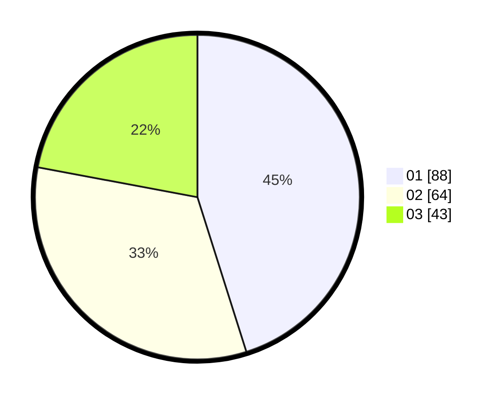

# Hasil

Hasil perolehan suara paslon dapat dilihat pada file paslon-01.txt, paslon-02.txt, dan paslon-03.txt.

Jika tidak ada, artinya data tersebut belum ada pada SIREKAP.

## Perolehan Suara

 * Paslon 01: **88**.
 * Paslon 02: **64**.
 * Paslon 03: **43**.

## Foto C Plano

https://sirekap-obj-formc.kpu.go.id/abd0/pemilu/ppwp/31/75/04/10/01/3175041001037-20240217-205743--972a6f16-c400-40fb-858a-e8d094724d07.jpg

https://sirekap-obj-formc.kpu.go.id/abd0/pemilu/ppwp/31/75/04/10/01/3175041001037-20240217-205340--3947459d-96cf-450c-bc79-78b6cc79a9c8.jpg

https://sirekap-obj-formc.kpu.go.id/abd0/pemilu/ppwp/31/75/04/10/01/3175041001037-20240217-205541--793a0ad4-68d5-452c-af02-694472fa4e42.jpg

## DATA PEMILIH TETAP

Jumlah pemilih dalam DPT: **251**.
 * L: **111**.
 * P: **140**.

## DATA PENGGUNA HAK PILIH

Jumlah pengguna hak pilih dalam DPT: **189**.
 * L: **82**.
 * P: **107**.

Jumlah pengguna hak pilih dalam DPTb: **4**.
 * L: **1**.
 * P: **3**.

Jumlah pengguna hak pilih dalam DPK: **2**.
 * L: **1**.
 * P: **1**.

Jumlah pengguna hak pilih: **195**.
 * L: **84**.
 * P: **111**.

## JUMLAH SUARA SAH DAN TIDAK SAH

JUMLAH SELURUH SUARA SAH: **195**.

JUMLAH SUARA TIDAK SAH: **0**.

JUMLAH SELURUH SUARA SAH DAN SUARA TIDAK SAH: **195**.
