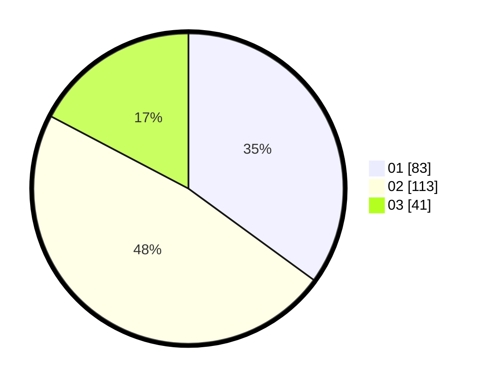

# Hasil

Hasil perolehan suara paslon dapat dilihat pada file paslon-01.txt, paslon-02.txt, dan paslon-03.txt.

Jika tidak ada, artinya data tersebut belum ada pada SIREKAP.

## Perolehan Suara

 * Paslon 01: **83**.
 * Paslon 02: **113**.
 * Paslon 03: **41**.

## Foto C Plano

https://sirekap-obj-formc.kpu.go.id/9a00/pemilu/ppwp/31/75/04/10/01/3175041001040-20240214-214339--6bd96ce8-8faf-4744-901d-a835a0cccaf1.jpg

https://sirekap-obj-formc.kpu.go.id/9a00/pemilu/ppwp/31/75/04/10/01/3175041001040-20240214-214418--f6fb39f4-e114-4902-81fa-87a791db1234.jpg

https://sirekap-obj-formc.kpu.go.id/9a00/pemilu/ppwp/31/75/04/10/01/3175041001040-20240214-214448--9411f1f8-a7aa-4082-b253-b3e271ed5c66.jpg
