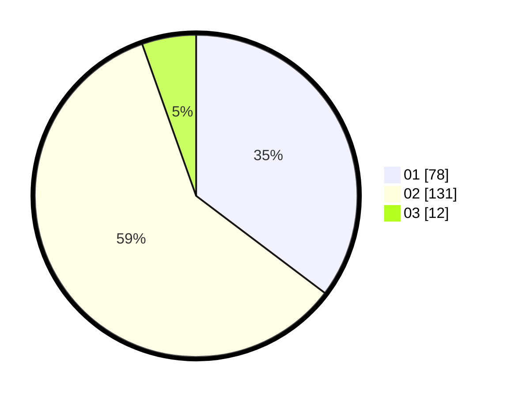

# Hasil

Hasil perolehan suara paslon dapat dilihat pada file paslon-01.txt, paslon-02.txt, dan paslon-03.txt.

Jika tidak ada, artinya data tersebut belum ada pada SIREKAP.

## Perolehan Suara

 * Paslon 01: **78**.
 * Paslon 02: **131**.
 * Paslon 03: **12**.

## Foto C Plano

https://sirekap-obj-formc.kpu.go.id/9e67/pemilu/ppwp/31/75/04/10/01/3175041001059-20240214-185203--eafbe697-563c-439a-a4b0-d93af63d30e8.jpg

https://sirekap-obj-formc.kpu.go.id/9e67/pemilu/ppwp/31/75/04/10/01/3175041001059-20240214-190022--53a53231-1882-4402-bde3-f8a1dd826c74.jpg

https://sirekap-obj-formc.kpu.go.id/9e67/pemilu/ppwp/31/75/04/10/01/3175041001059-20240214-190227--8a0264d0-1b4a-4bef-a769-c10fd5f68114.jpg

## DATA PEMILIH TETAP

Jumlah pemilih dalam DPT: **277**.
 * L: **96**.
 * P: **181**.

## DATA PENGGUNA HAK PILIH

Jumlah pengguna hak pilih dalam DPT: **208**.
 * L: **65**.
 * P: **143**.

Jumlah pengguna hak pilih dalam DPTb: **0**.
 * L: **0**.
 * P: **0**.

Jumlah pengguna hak pilih dalam DPK: **16**.
 * L: **6**.
 * P: **10**.

Jumlah pengguna hak pilih: **224**.
 * L: **71**.
 * P: **153**.

## JUMLAH SUARA SAH DAN TIDAK SAH

JUMLAH SELURUH SUARA SAH: **221**.

JUMLAH SUARA TIDAK SAH: **3**.

JUMLAH SELURUH SUARA SAH DAN SUARA TIDAK SAH: **224**.
