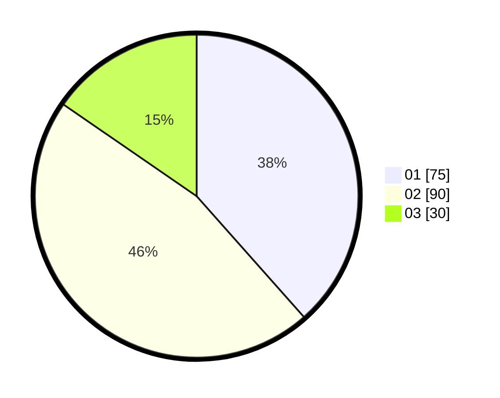

# Hasil

Hasil perolehan suara paslon dapat dilihat pada file paslon-01.txt, paslon-02.txt, dan paslon-03.txt.

Jika tidak ada, artinya data tersebut belum ada pada SIREKAP.

## Perolehan Suara

 * Paslon 01: **75**.
 * Paslon 02: **90**.
 * Paslon 03: **30**.

## Foto C Plano

https://sirekap-obj-formc.kpu.go.id/b8b9/pemilu/ppwp/31/75/04/10/01/3175041001069-20240214-185725--a002f872-362e-4a6d-9360-817ce3acd0d5.jpg

https://sirekap-obj-formc.kpu.go.id/b8b9/pemilu/ppwp/31/75/04/10/01/3175041001069-20240214-185907--9f781e49-4cf6-46b8-b238-632b7a7afbc9.jpg

https://sirekap-obj-formc.kpu.go.id/b8b9/pemilu/ppwp/31/75/04/10/01/3175041001069-20240214-185957--30eb19cd-9b93-4a9b-99ac-531312969d2e.jpg

## DATA PEMILIH TETAP

Jumlah pemilih dalam DPT: **270**.
 * L: **144**.
 * P: **126**.

## DATA PENGGUNA HAK PILIH

Jumlah pengguna hak pilih dalam DPT: **202**.
 * L: **103**.
 * P: **99**.

Jumlah pengguna hak pilih dalam DPTb: **0**.
 * L: **0**.
 * P: **0**.

Jumlah pengguna hak pilih dalam DPK: **1**.
 * L: **0**.
 * P: **1**.

Jumlah pengguna hak pilih: **203**.
 * L: **103**.
 * P: **100**.

## JUMLAH SUARA SAH DAN TIDAK SAH

JUMLAH SELURUH SUARA SAH: **195**.

JUMLAH SUARA TIDAK SAH: **8**.

JUMLAH SELURUH SUARA SAH DAN SUARA TIDAK SAH: **203**.
