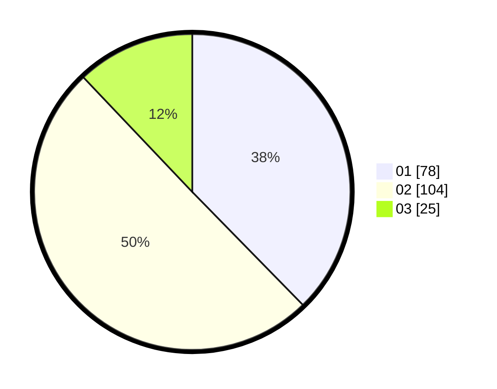

# Hasil

Hasil perolehan suara paslon dapat dilihat pada file paslon-01.txt, paslon-02.txt, dan paslon-03.txt.

Jika tidak ada, artinya data tersebut belum ada pada SIREKAP.

## Perolehan Suara

 * Paslon 01: **78**.
 * Paslon 02: **104**.
 * Paslon 03: **25**.

## Foto C Plano

https://sirekap-obj-formc.kpu.go.id/9827/pemilu/ppwp/31/75/04/10/01/3175041001071-20240217-162515--3ce278f7-36fa-4254-8f4d-44da2459d0b6.jpg

https://sirekap-obj-formc.kpu.go.id/9827/pemilu/ppwp/31/75/04/10/01/3175041001071-20240217-162930--96a6c72e-79dc-4a22-9fe0-a5a4e8916e15.jpg

https://sirekap-obj-formc.kpu.go.id/9827/pemilu/ppwp/31/75/04/10/01/3175041001071-20240217-163113--424731c7-132a-4683-94c6-331d5af7688f.jpg
