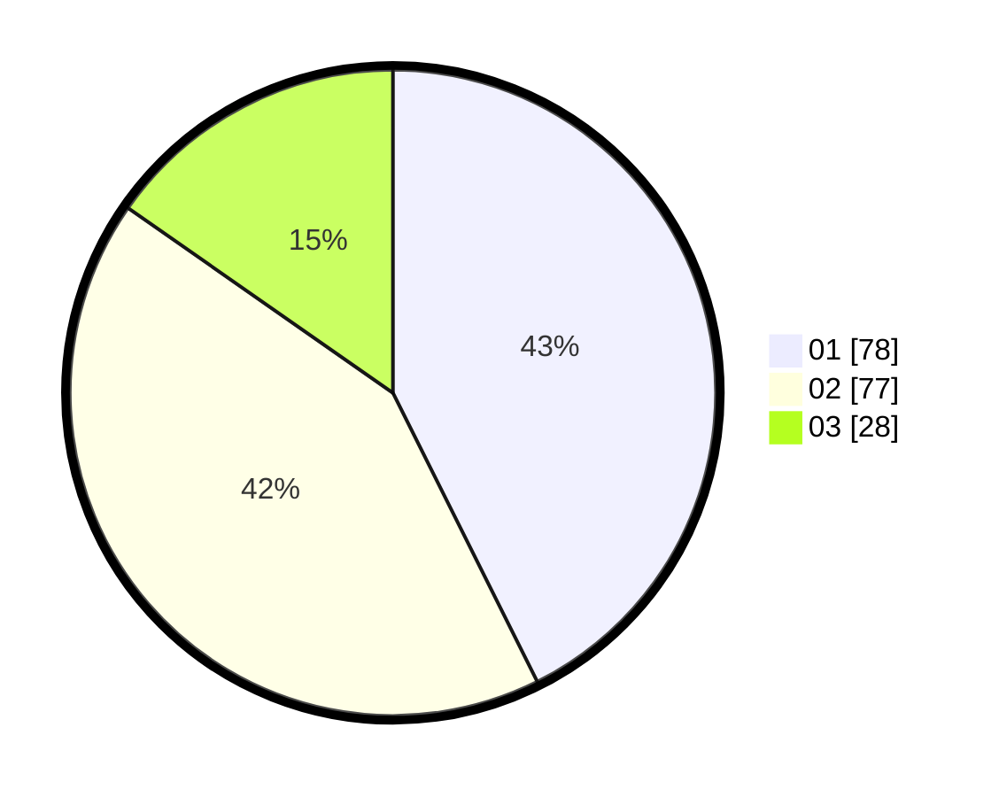

# Hasil

Hasil perolehan suara paslon dapat dilihat pada file paslon-01.txt, paslon-02.txt, dan paslon-03.txt.

Jika tidak ada, artinya data tersebut belum ada pada SIREKAP.

## Perolehan Suara

 * Paslon 01: **78**.
 * Paslon 02: **77**.
 * Paslon 03: **28**.

## Foto C Plano

https://sirekap-obj-formc.kpu.go.id/3b7b/pemilu/ppwp/31/75/04/10/01/3175041001072-20240217-205000--341ae4a3-092b-424d-8707-180005a796e5.jpg

https://sirekap-obj-formc.kpu.go.id/3b7b/pemilu/ppwp/31/75/04/10/01/3175041001072-20240217-205205--035ff2ff-d95d-459e-8207-8639a84b81b5.jpg

https://sirekap-obj-formc.kpu.go.id/3b7b/pemilu/ppwp/31/75/04/10/01/3175041001072-20240217-205312--21d98110-47b4-49b8-af1b-16b78fcbdf92.jpg

## DATA PEMILIH TETAP

Jumlah pemilih dalam DPT: **278**.
 * L: **136**.
 * P: **142**.

## DATA PENGGUNA HAK PILIH

Jumlah pengguna hak pilih dalam DPT: **186**.
 * L: **87**.
 * P: **99**.

Jumlah pengguna hak pilih dalam DPTb: **2**.
 * L: **2**.
 * P: **0**.

Jumlah pengguna hak pilih dalam DPK: **1**.
 * L: **1**.
 * P: **0**.

Jumlah pengguna hak pilih: **189**.
 * L: **90**.
 * P: **99**.

## JUMLAH SUARA SAH DAN TIDAK SAH

JUMLAH SELURUH SUARA SAH: **183**.

JUMLAH SUARA TIDAK SAH: **6**.

JUMLAH SELURUH SUARA SAH DAN SUARA TIDAK SAH: **189**.
