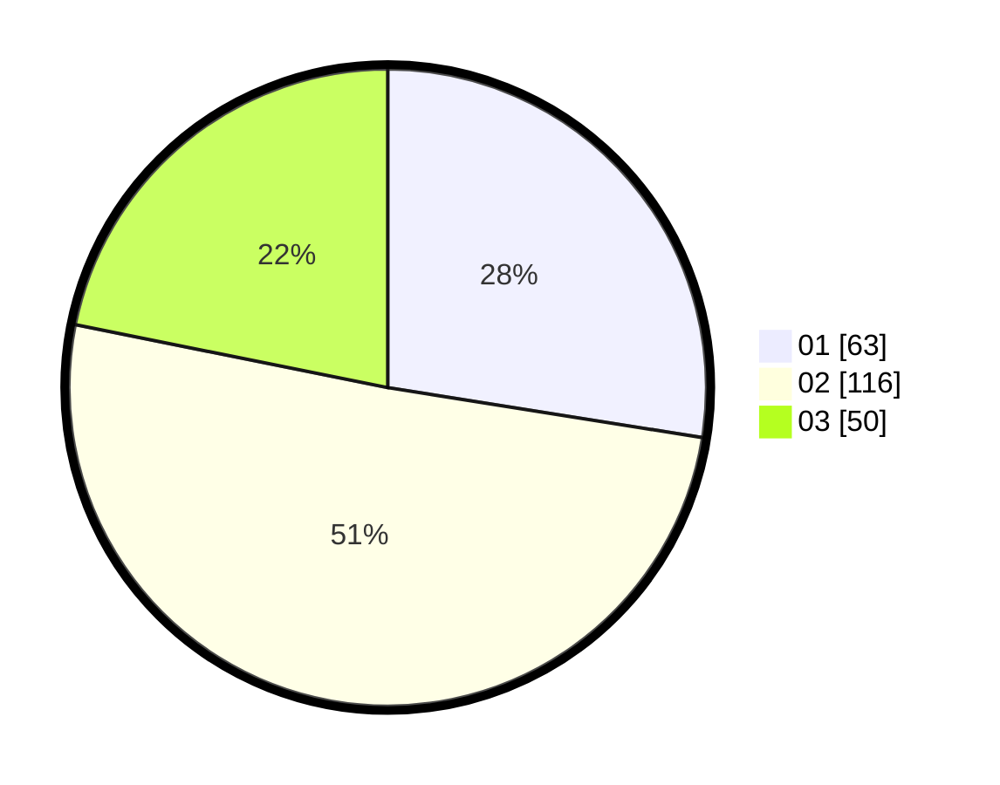

# Hasil

Hasil perolehan suara paslon dapat dilihat pada file paslon-01.txt, paslon-02.txt, dan paslon-03.txt.

Jika tidak ada, artinya data tersebut belum ada pada SIREKAP.

## Perolehan Suara

 * Paslon 01: **63**.
 * Paslon 02: **116**.
 * Paslon 03: **50**.

## Foto C Plano

https://sirekap-obj-formc.kpu.go.id/a0cb/pemilu/ppwp/31/75/04/10/01/3175041001074-20240214-221933--d29c385d-5929-472c-a61c-b4d62d6da567.jpg

https://sirekap-obj-formc.kpu.go.id/a0cb/pemilu/ppwp/31/75/04/10/01/3175041001074-20240214-222023--727e7dfa-1b86-4ca5-8d9c-e2685cbdacdf.jpg

https://sirekap-obj-formc.kpu.go.id/a0cb/pemilu/ppwp/31/75/04/10/01/3175041001074-20240214-222118--c9bdf6ed-7c8c-4df6-919f-8ed4e1ca92da.jpg
