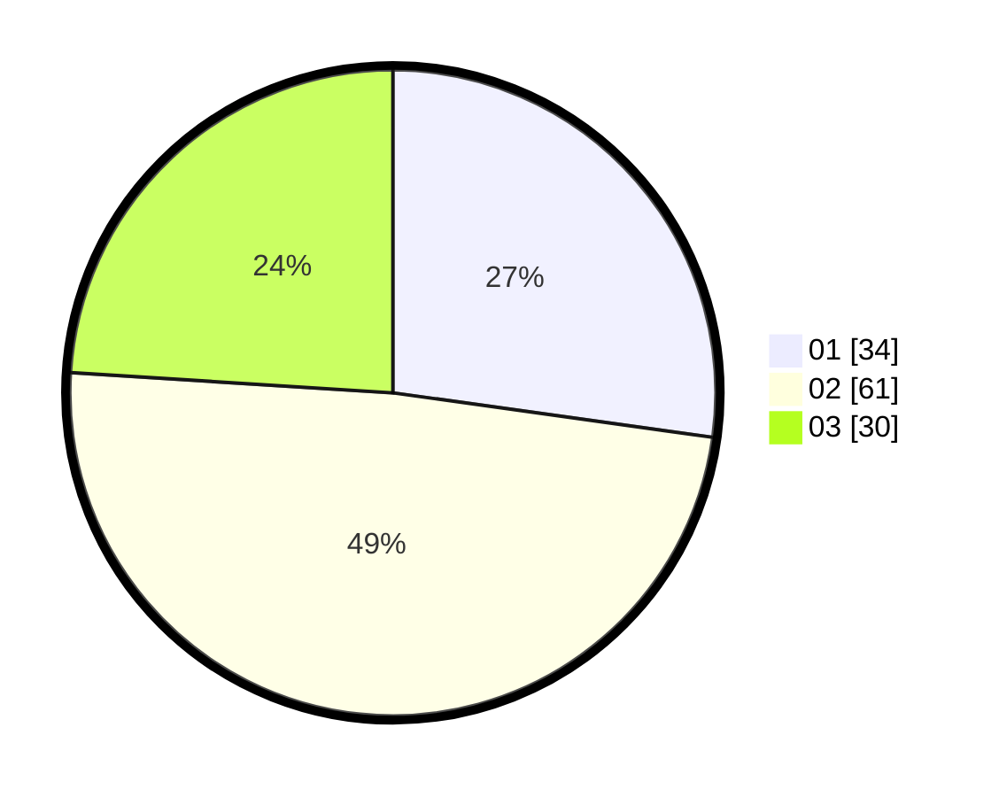

# Hasil

Hasil perolehan suara paslon dapat dilihat pada file paslon-01.txt, paslon-02.txt, dan paslon-03.txt.

Jika tidak ada, artinya data tersebut belum ada pada SIREKAP.

## Perolehan Suara

 * Paslon 01: **34**.
 * Paslon 02: **61**.
 * Paslon 03: **30**.

## Foto C Plano

https://sirekap-obj-formc.kpu.go.id/a39c/pemilu/ppwp/31/75/04/10/01/3175041001076-20240215-004140--4fea2727-e8f4-4af5-af8c-f80ba9510783.jpg

https://sirekap-obj-formc.kpu.go.id/a39c/pemilu/ppwp/31/75/04/10/01/3175041001076-20240215-004813--e306b5d9-0e84-4592-9b47-bf2cfb8d9407.jpg

https://sirekap-obj-formc.kpu.go.id/a39c/pemilu/ppwp/31/75/04/10/01/3175041001076-20240215-004851--e9951a7d-0f81-415d-9b80-c828061d65fd.jpg

## DATA PEMILIH TETAP

Jumlah pemilih dalam DPT: **166**.
 * L: **83**.
 * P: **83**.

## DATA PENGGUNA HAK PILIH

Jumlah pengguna hak pilih dalam DPT: **123**.
 * L: **59**.
 * P: **64**.

Jumlah pengguna hak pilih dalam DPTb: **0**.
 * L: **0**.
 * P: **0**.

Jumlah pengguna hak pilih dalam DPK: **4**.
 * L: **1**.
 * P: **3**.

Jumlah pengguna hak pilih: **127**.
 * L: **60**.
 * P: **67**.

## JUMLAH SUARA SAH DAN TIDAK SAH

JUMLAH SELURUH SUARA SAH: **125**.

JUMLAH SUARA TIDAK SAH: **2**.

JUMLAH SELURUH SUARA SAH DAN SUARA TIDAK SAH: **127**.
