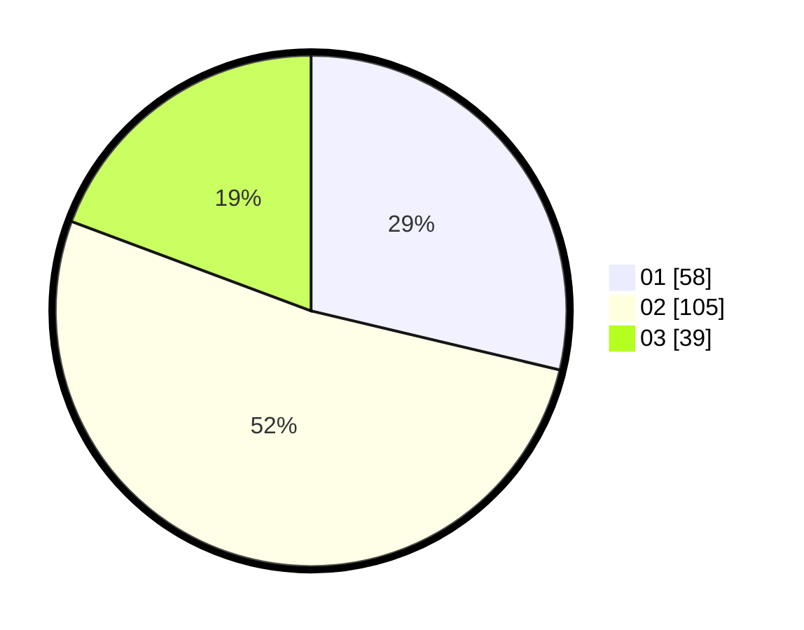

# Hasil

Hasil perolehan suara paslon dapat dilihat pada file paslon-01.txt, paslon-02.txt, dan paslon-03.txt.

Jika tidak ada, artinya data tersebut belum ada pada SIREKAP.

## Perolehan Suara

 * Paslon 01: **58**.
 * Paslon 02: **105**.
 * Paslon 03: **39**.

## Foto C Plano

https://sirekap-obj-formc.kpu.go.id/2621/pemilu/ppwp/31/75/04/10/01/3175041001078-20240214-155722--f9af7851-7d24-4ac8-8596-023abbc3a6e2.jpg

https://sirekap-obj-formc.kpu.go.id/2621/pemilu/ppwp/31/75/04/10/01/3175041001078-20240214-160116--4a96cc8a-1f60-4750-8887-a6b3bddebc09.jpg

https://sirekap-obj-formc.kpu.go.id/2621/pemilu/ppwp/31/75/04/10/01/3175041001078-20240214-160119--97bbeca2-ad95-49d1-afd3-0a491b10320b.jpg

## DATA PEMILIH TETAP

Jumlah pemilih dalam DPT: **272**.
 * L: **136**.
 * P: **136**.

## DATA PENGGUNA HAK PILIH

Jumlah pengguna hak pilih dalam DPT: **205**.
 * L: **95**.
 * P: **110**.

Jumlah pengguna hak pilih dalam DPTb: **0**.
 * L: **0**.
 * P: **0**.

Jumlah pengguna hak pilih dalam DPK: **1**.
 * L: **1**.
 * P: **0**.

Jumlah pengguna hak pilih: **206**.
 * L: **95**.
 * P: **110**.

## JUMLAH SUARA SAH DAN TIDAK SAH

JUMLAH SELURUH SUARA SAH: **202**.

JUMLAH SUARA TIDAK SAH: **4**.

JUMLAH SELURUH SUARA SAH DAN SUARA TIDAK SAH: **206**.
