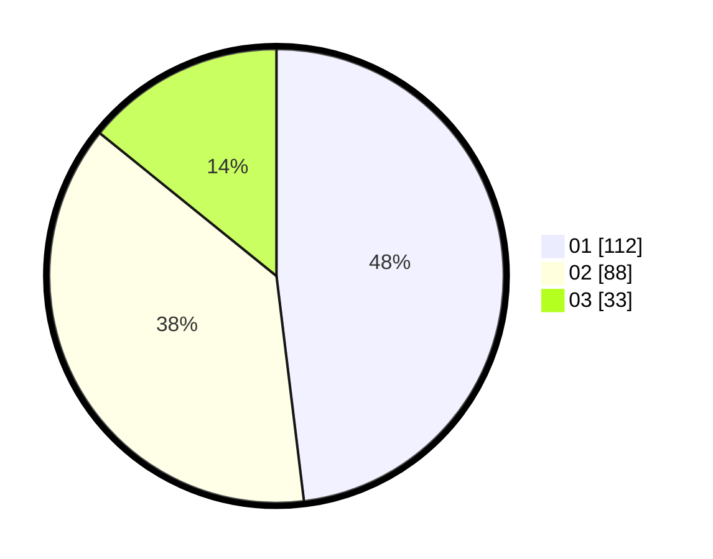

# Hasil

Hasil perolehan suara paslon dapat dilihat pada file paslon-01.txt, paslon-02.txt, dan paslon-03.txt.

Jika tidak ada, artinya data tersebut belum ada pada SIREKAP.

## Perolehan Suara

 * Paslon 01: **112**.
 * Paslon 02: **88**.
 * Paslon 03: **33**.

## Foto C Plano

https://sirekap-obj-formc.kpu.go.id/3f89/pemilu/ppwp/31/75/04/10/01/3175041001085-20240214-205538--9412c837-2181-4fc4-9b11-3c68679df82b.jpg

https://sirekap-obj-formc.kpu.go.id/3f89/pemilu/ppwp/31/75/04/10/01/3175041001085-20240214-205534--e161aebf-de62-43f4-b9fd-28e8ec0edd60.jpg

https://sirekap-obj-formc.kpu.go.id/3f89/pemilu/ppwp/31/75/04/10/01/3175041001085-20240214-205524--1f26a994-0fe9-4793-9a30-0e8746d30a4d.jpg
