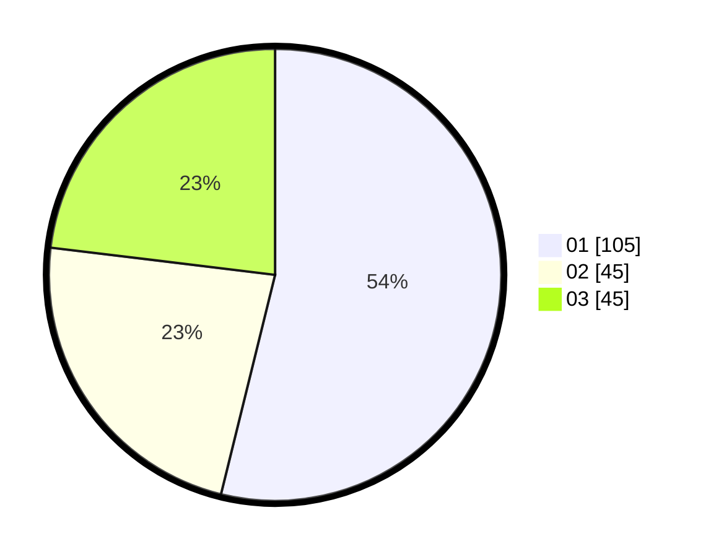

# Hasil

Hasil perolehan suara paslon dapat dilihat pada file paslon-01.txt, paslon-02.txt, dan paslon-03.txt.

Jika tidak ada, artinya data tersebut belum ada pada SIREKAP.

## Perolehan Suara

 * Paslon 01: **105**.
 * Paslon 02: **45**.
 * Paslon 03: **45**.

## Foto C Plano

https://sirekap-obj-formc.kpu.go.id/af3f/pemilu/ppwp/31/75/04/10/01/3175041001087-20240215-121642--17db7534-e8ff-4a12-95d7-026cdf4fa376.jpg

https://sirekap-obj-formc.kpu.go.id/af3f/pemilu/ppwp/31/75/04/10/01/3175041001087-20240214-201521--8846720c-ddd3-4b7b-9189-93c8e1266c61.jpg

https://sirekap-obj-formc.kpu.go.id/af3f/pemilu/ppwp/31/75/04/10/01/3175041001087-20240216-004350--eefd0f60-a5ee-4794-8f61-48193d4a4924.jpg

## DATA PEMILIH TETAP

Jumlah pemilih dalam DPT: **293**.
 * L: **136**.
 * P: **157**.

## DATA PENGGUNA HAK PILIH

Jumlah pengguna hak pilih dalam DPT: **252**.
 * L: **116**.
 * P: **136**.

Jumlah pengguna hak pilih dalam DPTb: **0**.
 * L: **0**.
 * P: **0**.

Jumlah pengguna hak pilih dalam DPK: **2**.
 * L: **2**.
 * P: **0**.

Jumlah pengguna hak pilih: **254**.
 * L: **118**.
 * P: **136**.

## JUMLAH SUARA SAH DAN TIDAK SAH

JUMLAH SELURUH SUARA SAH: **245**.

JUMLAH SUARA TIDAK SAH: **9**.

JUMLAH SELURUH SUARA SAH DAN SUARA TIDAK SAH: **254**.
