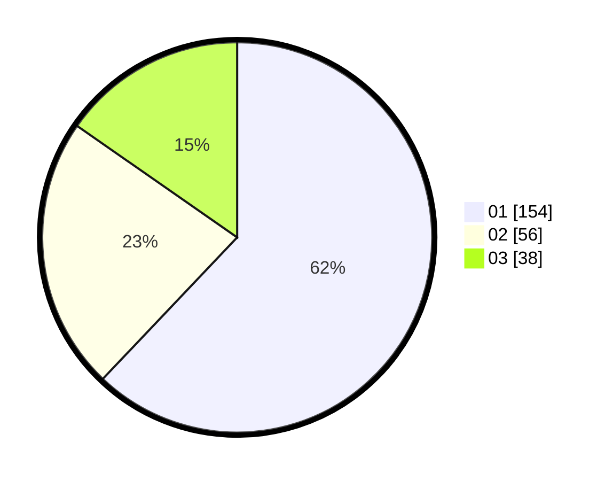

# Hasil

Hasil perolehan suara paslon dapat dilihat pada file paslon-01.txt, paslon-02.txt, dan paslon-03.txt.

Jika tidak ada, artinya data tersebut belum ada pada SIREKAP.

## Perolehan Suara

 * Paslon 01: **154**.
 * Paslon 02: **56**.
 * Paslon 03: **38**.

## Foto C Plano

https://sirekap-obj-formc.kpu.go.id/f04d/pemilu/ppwp/31/75/04/10/01/3175041001089-20240217-191617--b62e29c6-f16a-43ee-a28d-c952fa1eda82.jpg

https://sirekap-obj-formc.kpu.go.id/f04d/pemilu/ppwp/31/75/04/10/01/3175041001089-20240217-192338--6474212f-b004-4a13-bf59-f6c1d8de228e.jpg

https://sirekap-obj-formc.kpu.go.id/f04d/pemilu/ppwp/31/75/04/10/01/3175041001089-20240217-192932--a81b3c66-2b68-403b-841a-23e868409992.jpg

## DATA PEMILIH TETAP

Jumlah pemilih dalam DPT: **297**.
 * L: **142**.
 * P: **149**.

## DATA PENGGUNA HAK PILIH

Jumlah pengguna hak pilih dalam DPT: **246**.
 * L: **114**.
 * P: **132**.

Jumlah pengguna hak pilih dalam DPTb: **6**.
 * L: **3**.
 * P: **3**.

Jumlah pengguna hak pilih dalam DPK: **1**.
 * L: **0**.
 * P: **1**.

Jumlah pengguna hak pilih: **253**.
 * L: **117**.
 * P: **136**.

## JUMLAH SUARA SAH DAN TIDAK SAH

JUMLAH SELURUH SUARA SAH: **248**.

JUMLAH SUARA TIDAK SAH: **5**.

JUMLAH SELURUH SUARA SAH DAN SUARA TIDAK SAH: **253**.
