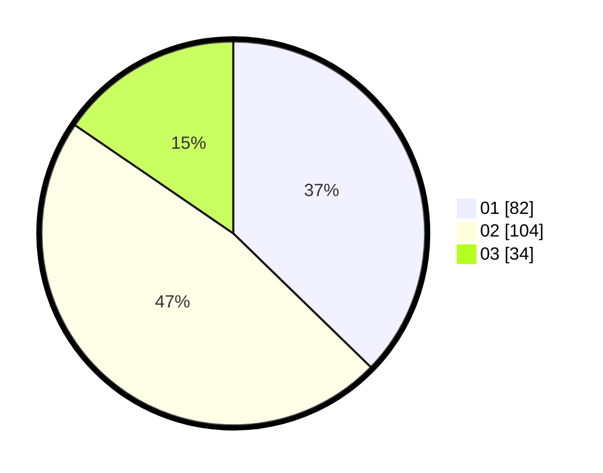

# Hasil

Hasil perolehan suara paslon dapat dilihat pada file paslon-01.txt, paslon-02.txt, dan paslon-03.txt.

Jika tidak ada, artinya data tersebut belum ada pada SIREKAP.

## Perolehan Suara

 * Paslon 01: **82**.
 * Paslon 02: **104**.
 * Paslon 03: **34**.

## Foto C Plano

https://sirekap-obj-formc.kpu.go.id/8b14/pemilu/ppwp/31/75/04/10/01/3175041001095-20240214-190153--073c958a-af3b-4b3b-8953-79f0908a2cc2.jpg

https://sirekap-obj-formc.kpu.go.id/8b14/pemilu/ppwp/31/75/04/10/01/3175041001095-20240214-190202--69bdbb01-a82c-492f-9362-9f738a144f09.jpg

https://sirekap-obj-formc.kpu.go.id/8b14/pemilu/ppwp/31/75/04/10/01/3175041001095-20240214-190211--6a3bf823-e943-4877-b52e-8851aa5ac162.jpg
