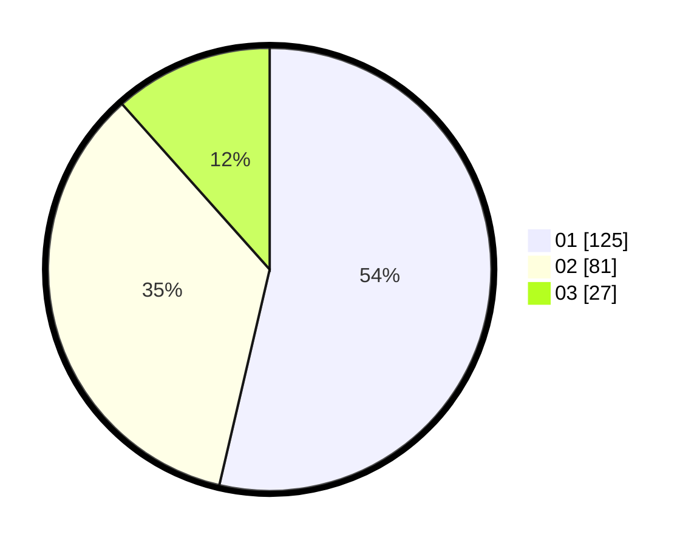

# Hasil

Hasil perolehan suara paslon dapat dilihat pada file paslon-01.txt, paslon-02.txt, dan paslon-03.txt.

Jika tidak ada, artinya data tersebut belum ada pada SIREKAP.

## Perolehan Suara

 * Paslon 01: **125**.
 * Paslon 02: **81**.
 * Paslon 03: **27**.

## Foto C Plano

https://sirekap-obj-formc.kpu.go.id/588f/pemilu/ppwp/31/75/04/10/01/3175041001103-20240214-224915--838d3383-d1b2-43a1-b57b-1006b45ecebb.jpg

https://sirekap-obj-formc.kpu.go.id/588f/pemilu/ppwp/31/75/04/10/01/3175041001103-20240214-224556--dbe6c247-049b-4da5-ac8f-dbef1ceedba6.jpg

https://sirekap-obj-formc.kpu.go.id/588f/pemilu/ppwp/31/75/04/10/01/3175041001103-20240214-224433--694f689a-08ca-488c-a543-0d056bb26fd3.jpg
