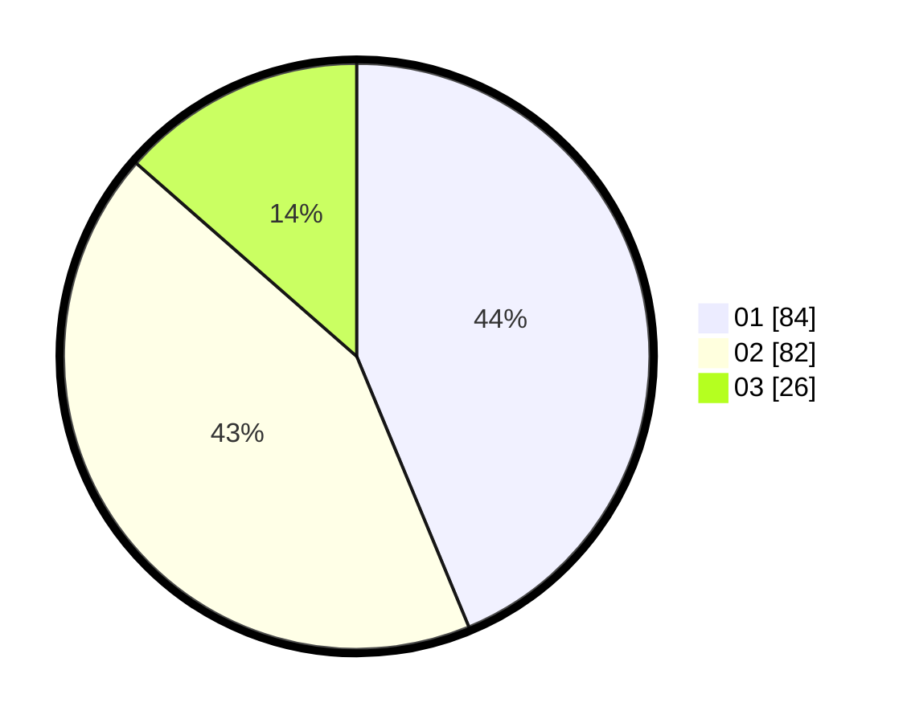

# Hasil

Hasil perolehan suara paslon dapat dilihat pada file paslon-01.txt, paslon-02.txt, dan paslon-03.txt.

Jika tidak ada, artinya data tersebut belum ada pada SIREKAP.

## Perolehan Suara

 * Paslon 01: **84**.
 * Paslon 02: **82**.
 * Paslon 03: **26**.

## Foto C Plano

https://sirekap-obj-formc.kpu.go.id/7c3f/pemilu/ppwp/31/75/04/10/01/3175041001109-20240214-194150--c777bd5a-adc6-4423-bbd9-3604fef4257f.jpg

https://sirekap-obj-formc.kpu.go.id/7c3f/pemilu/ppwp/31/75/04/10/01/3175041001109-20240214-194201--600ab09b-f85c-46a0-b6c1-618fdfcf9ce7.jpg

https://sirekap-obj-formc.kpu.go.id/7c3f/pemilu/ppwp/31/75/04/10/01/3175041001109-20240214-194209--7e59ae9e-5f36-464b-ada7-d6e50a7bf816.jpg
