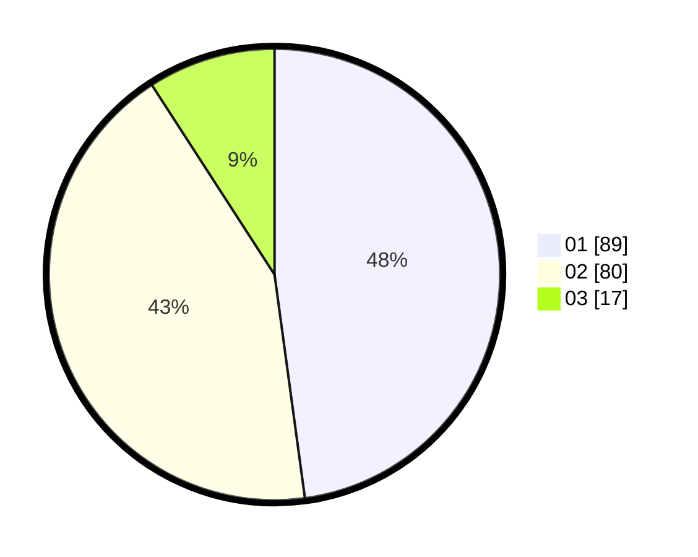

# Hasil

Hasil perolehan suara paslon dapat dilihat pada file paslon-01.txt, paslon-02.txt, dan paslon-03.txt.

Jika tidak ada, artinya data tersebut belum ada pada SIREKAP.

## Perolehan Suara

 * Paslon 01: **89**.
 * Paslon 02: **80**.
 * Paslon 03: **17**.

## Foto C Plano

https://sirekap-obj-formc.kpu.go.id/9a53/pemilu/ppwp/31/75/04/10/01/3175041001110-20240216-172634--3366b7eb-1410-48ee-a13b-6b87a3b77907.jpg

https://sirekap-obj-formc.kpu.go.id/9a53/pemilu/ppwp/31/75/04/10/01/3175041001110-20240216-102701--f6f62dcd-0f14-472f-9ca2-6abacd553b05.jpg

https://sirekap-obj-formc.kpu.go.id/9a53/pemilu/ppwp/31/75/04/10/01/3175041001110-20240214-204033--cb8f736f-7498-4d11-ab13-33c12b88b0be.jpg
