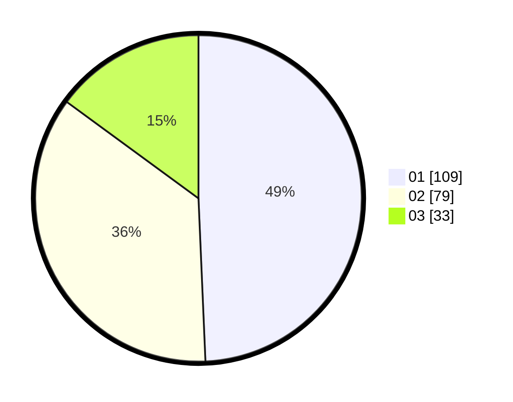

# Hasil

Hasil perolehan suara paslon dapat dilihat pada file paslon-01.txt, paslon-02.txt, dan paslon-03.txt.

Jika tidak ada, artinya data tersebut belum ada pada SIREKAP.

## Perolehan Suara

 * Paslon 01: **109**.
 * Paslon 02: **79**.
 * Paslon 03: **33**.

## Foto C Plano

https://sirekap-obj-formc.kpu.go.id/b1df/pemilu/ppwp/31/75/04/10/01/3175041001112-20240214-203503--03c08e55-91d2-4e5c-a96c-32ffddd7faac.jpg

https://sirekap-obj-formc.kpu.go.id/b1df/pemilu/ppwp/31/75/04/10/01/3175041001112-20240214-194438--c1857094-28dd-46ea-b74a-425cf95d4666.jpg

https://sirekap-obj-formc.kpu.go.id/b1df/pemilu/ppwp/31/75/04/10/01/3175041001112-20240218-154155--b887dc7e-1e3c-482b-86c9-af7b5ec351af.jpg
