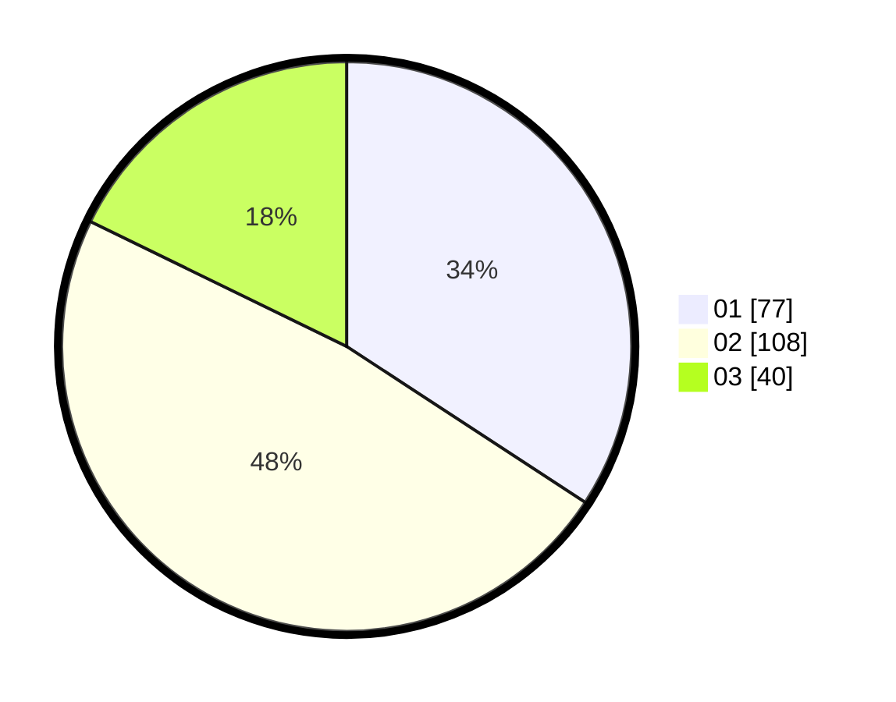

# Hasil

Hasil perolehan suara paslon dapat dilihat pada file paslon-01.txt, paslon-02.txt, dan paslon-03.txt.

Jika tidak ada, artinya data tersebut belum ada pada SIREKAP.

## Perolehan Suara

 * Paslon 01: **77**.
 * Paslon 02: **108**.
 * Paslon 03: **40**.

## Foto C Plano

https://sirekap-obj-formc.kpu.go.id/691b/pemilu/ppwp/31/75/04/10/02/3175041002003-20240216-090651--a2c82d8c-b24c-43c6-9c8f-d897bb9479b7.jpg

https://sirekap-obj-formc.kpu.go.id/691b/pemilu/ppwp/31/75/04/10/02/3175041002003-20240214-192823--0c713110-56ba-4005-b48b-fd88805b3cc6.jpg

https://sirekap-obj-formc.kpu.go.id/691b/pemilu/ppwp/31/75/04/10/02/3175041002003-20240216-091313--81d7a777-3b15-4ff2-8bca-d593041cb6d4.jpg

## DATA PEMILIH TETAP

Jumlah pemilih dalam DPT: **278**.
 * L: **137**.
 * P: **141**.

## DATA PENGGUNA HAK PILIH

Jumlah pengguna hak pilih dalam DPT: **223**.
 * L: **107**.
 * P: **116**.

Jumlah pengguna hak pilih dalam DPTb: **0**.
 * L: **0**.
 * P: **0**.

Jumlah pengguna hak pilih dalam DPK: **7**.
 * L: **2**.
 * P: **5**.

Jumlah pengguna hak pilih: **230**.
 * L: **109**.
 * P: **121**.

## JUMLAH SUARA SAH DAN TIDAK SAH

JUMLAH SELURUH SUARA SAH: **225**.

JUMLAH SUARA TIDAK SAH: **5**.

JUMLAH SELURUH SUARA SAH DAN SUARA TIDAK SAH: **230**.
