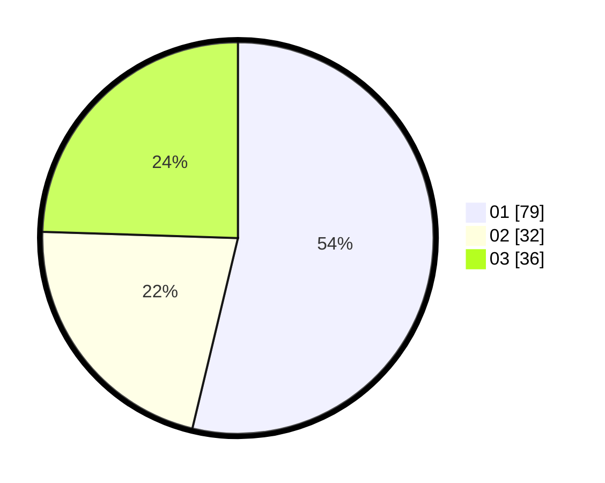

# Hasil

Hasil perolehan suara paslon dapat dilihat pada file paslon-01.txt, paslon-02.txt, dan paslon-03.txt.

Jika tidak ada, artinya data tersebut belum ada pada SIREKAP.

## Perolehan Suara

 * Paslon 01: **79**.
 * Paslon 02: **32**.
 * Paslon 03: **36**.

## Foto C Plano

https://sirekap-obj-formc.kpu.go.id/d7fe/pemilu/ppwp/31/75/04/10/02/3175041002004-20240217-143202--a3d89e02-b792-41e6-9012-90203b058fc5.jpg

https://sirekap-obj-formc.kpu.go.id/d7fe/pemilu/ppwp/31/75/04/10/02/3175041002004-20240217-105831--68d7b688-18e5-45e2-8ad2-4382b7a6e6cc.jpg

https://sirekap-obj-formc.kpu.go.id/d7fe/pemilu/ppwp/31/75/04/10/02/3175041002004-20240217-110442--45736d71-6659-471a-8d1a-390865598af5.jpg

## DATA PEMILIH TETAP

Jumlah pemilih dalam DPT: **282**.
 * L: **143**.
 * P: **139**.

## DATA PENGGUNA HAK PILIH

Jumlah pengguna hak pilih dalam DPT: **236**.
 * L: **119**.
 * P: **117**.

Jumlah pengguna hak pilih dalam DPTb: **0**.
 * L: **0**.
 * P: **0**.

Jumlah pengguna hak pilih dalam DPK: **5**.
 * L: **1**.
 * P: **4**.

Jumlah pengguna hak pilih: **241**.
 * L: **120**.
 * P: **121**.

## JUMLAH SUARA SAH DAN TIDAK SAH

JUMLAH SELURUH SUARA SAH: **237**.

JUMLAH SUARA TIDAK SAH: **4**.

JUMLAH SELURUH SUARA SAH DAN SUARA TIDAK SAH: **241**.
