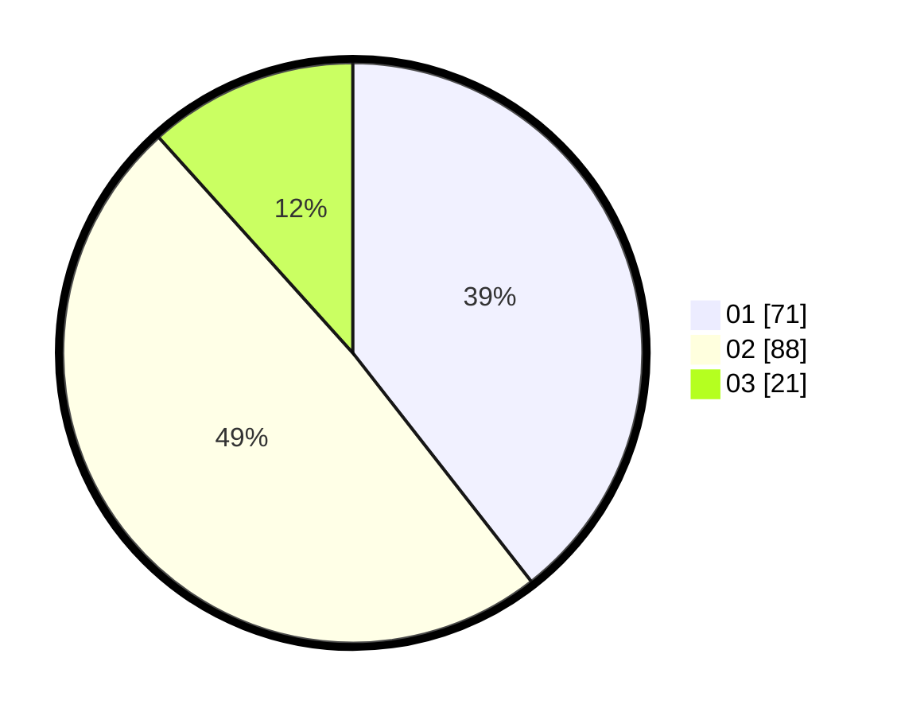

# Hasil

Hasil perolehan suara paslon dapat dilihat pada file paslon-01.txt, paslon-02.txt, dan paslon-03.txt.

Jika tidak ada, artinya data tersebut belum ada pada SIREKAP.

## Perolehan Suara

 * Paslon 01: **71**.
 * Paslon 02: **88**.
 * Paslon 03: **21**.

## Foto C Plano

https://sirekap-obj-formc.kpu.go.id/f7b9/pemilu/ppwp/31/75/04/10/02/3175041002012-20240218-203702--def2cbe1-9d91-4def-bef1-177a1325ae17.jpg

https://sirekap-obj-formc.kpu.go.id/f7b9/pemilu/ppwp/31/75/04/10/02/3175041002012-20240214-210948--2278e8f9-2efe-4aa9-836a-a5113c2127fc.jpg

https://sirekap-obj-formc.kpu.go.id/f7b9/pemilu/ppwp/31/75/04/10/02/3175041002012-20240218-204724--e4cec23a-ae7b-49ea-b341-1fb1cdb84b56.jpg
