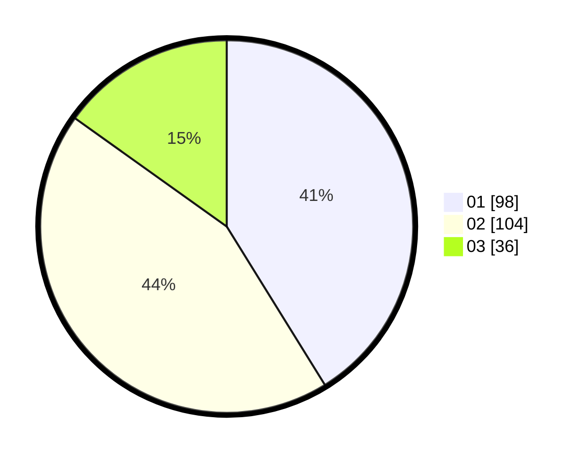

# Hasil

Hasil perolehan suara paslon dapat dilihat pada file paslon-01.txt, paslon-02.txt, dan paslon-03.txt.

Jika tidak ada, artinya data tersebut belum ada pada SIREKAP.

## Perolehan Suara

 * Paslon 01: **98**.
 * Paslon 02: **104**.
 * Paslon 03: **36**.

## Foto C Plano

https://sirekap-obj-formc.kpu.go.id/6805/pemilu/ppwp/31/75/04/10/02/3175041002023-20240215-182628--9aa0d2da-bde9-44dc-804a-2d8ed4280e29.jpg

https://sirekap-obj-formc.kpu.go.id/6805/pemilu/ppwp/31/75/04/10/02/3175041002023-20240216-161237--15d67a34-1279-4c00-b8e4-b8b4b5dea287.jpg

https://sirekap-obj-formc.kpu.go.id/6805/pemilu/ppwp/31/75/04/10/02/3175041002023-20240216-161325--7d37f175-f1b7-4268-b026-17cc191267f4.jpg

## DATA PEMILIH TETAP

Jumlah pemilih dalam DPT: **296**.
 * L: **148**.
 * P: **148**.

## DATA PENGGUNA HAK PILIH

Jumlah pengguna hak pilih dalam DPT: **241**.
 * L: **115**.
 * P: **126**.

Jumlah pengguna hak pilih dalam DPTb: **0**.
 * L: **0**.
 * P: **0**.

Jumlah pengguna hak pilih dalam DPK: **2**.
 * L: **1**.
 * P: **1**.

Jumlah pengguna hak pilih: **243**.
 * L: **116**.
 * P: **127**.

## JUMLAH SUARA SAH DAN TIDAK SAH

JUMLAH SELURUH SUARA SAH: **238**.

JUMLAH SUARA TIDAK SAH: **5**.

JUMLAH SELURUH SUARA SAH DAN SUARA TIDAK SAH: **243**.
