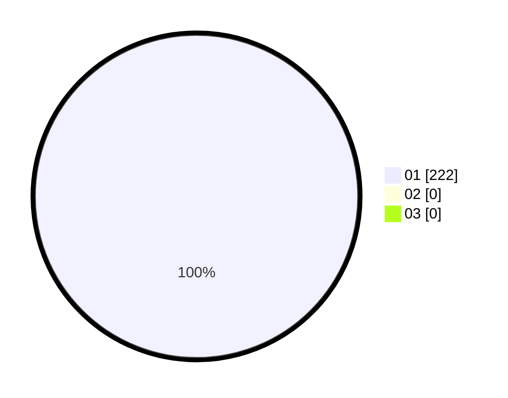

# Hasil

Hasil perolehan suara paslon dapat dilihat pada file paslon-01.txt, paslon-02.txt, dan paslon-03.txt.

Jika tidak ada, artinya data tersebut belum ada pada SIREKAP.

## Perolehan Suara

 * Paslon 01: **222**.
 * Paslon 02: **0**.
 * Paslon 03: **0**.

## Foto C Plano

https://sirekap-obj-formc.kpu.go.id/8928/pemilu/ppwp/31/75/04/10/02/3175041002026-20240218-212129--bce5166c-80ca-4107-8e6c-ea1e89739a61.jpg

https://sirekap-obj-formc.kpu.go.id/8928/pemilu/ppwp/31/75/04/10/02/3175041002026-20240218-190426--893f33f5-3846-4f28-9fe3-731c1cdddf16.jpg

https://sirekap-obj-formc.kpu.go.id/8928/pemilu/ppwp/31/75/04/10/02/3175041002026-20240218-212303--689d7c17-89d5-4dcd-a1cc-4335343e9758.jpg

## DATA PEMILIH TETAP

Jumlah pemilih dalam DPT: **550**.
 * L: **262**.
 * P: **224**.

## DATA PENGGUNA HAK PILIH

Jumlah pengguna hak pilih dalam DPT: **12**.
 * L: **155**.
 * P: **0**.

Jumlah pengguna hak pilih dalam DPTb: **0**.
 * L: **157**.
 * P: **0**.

Jumlah pengguna hak pilih dalam DPK: **0**.
 * L: **700**.
 * P: **0**.

Jumlah pengguna hak pilih: **0**.
 * L: **0**.
 * P: **0**.

## JUMLAH SUARA SAH DAN TIDAK SAH

JUMLAH SELURUH SUARA SAH: **0**.

JUMLAH SUARA TIDAK SAH: **0**.

JUMLAH SELURUH SUARA SAH DAN SUARA TIDAK SAH: **100**.
