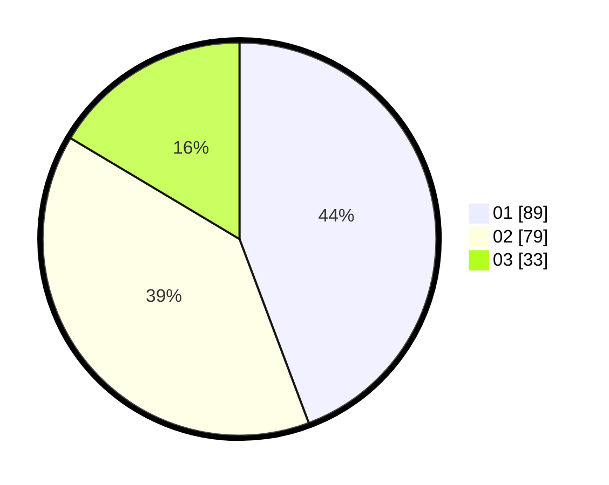

# Hasil

Hasil perolehan suara paslon dapat dilihat pada file paslon-01.txt, paslon-02.txt, dan paslon-03.txt.

Jika tidak ada, artinya data tersebut belum ada pada SIREKAP.

## Perolehan Suara

 * Paslon 01: **89**.
 * Paslon 02: **79**.
 * Paslon 03: **33**.

## Foto C Plano

https://sirekap-obj-formc.kpu.go.id/93c1/pemilu/ppwp/31/75/04/10/02/3175041002030-20240214-210122--ddad44e9-a15c-449b-8d65-c08a7607378d.jpg

https://sirekap-obj-formc.kpu.go.id/93c1/pemilu/ppwp/31/75/04/10/02/3175041002030-20240214-210232--3d697244-0da4-462b-9fa1-d37a2285d15c.jpg

https://sirekap-obj-formc.kpu.go.id/93c1/pemilu/ppwp/31/75/04/10/02/3175041002030-20240214-210316--a7a3017d-521b-43f5-96fc-37c2e28500ff.jpg

## DATA PEMILIH TETAP

Jumlah pemilih dalam DPT: **209**.
 * L: **110**.
 * P: **99**.

## DATA PENGGUNA HAK PILIH

Jumlah pengguna hak pilih dalam DPT: **209**.
 * L: **110**.
 * P: **99**.

Jumlah pengguna hak pilih dalam DPTb: **1**.
 * L: **0**.
 * P: **1**.

Jumlah pengguna hak pilih dalam DPK: **2**.
 * L: **0**.
 * P: **2**.

Jumlah pengguna hak pilih: **212**.
 * L: **110**.
 * P: **102**.

## JUMLAH SUARA SAH DAN TIDAK SAH

JUMLAH SELURUH SUARA SAH: **201**.

JUMLAH SUARA TIDAK SAH: **11**.

JUMLAH SELURUH SUARA SAH DAN SUARA TIDAK SAH: **212**.
