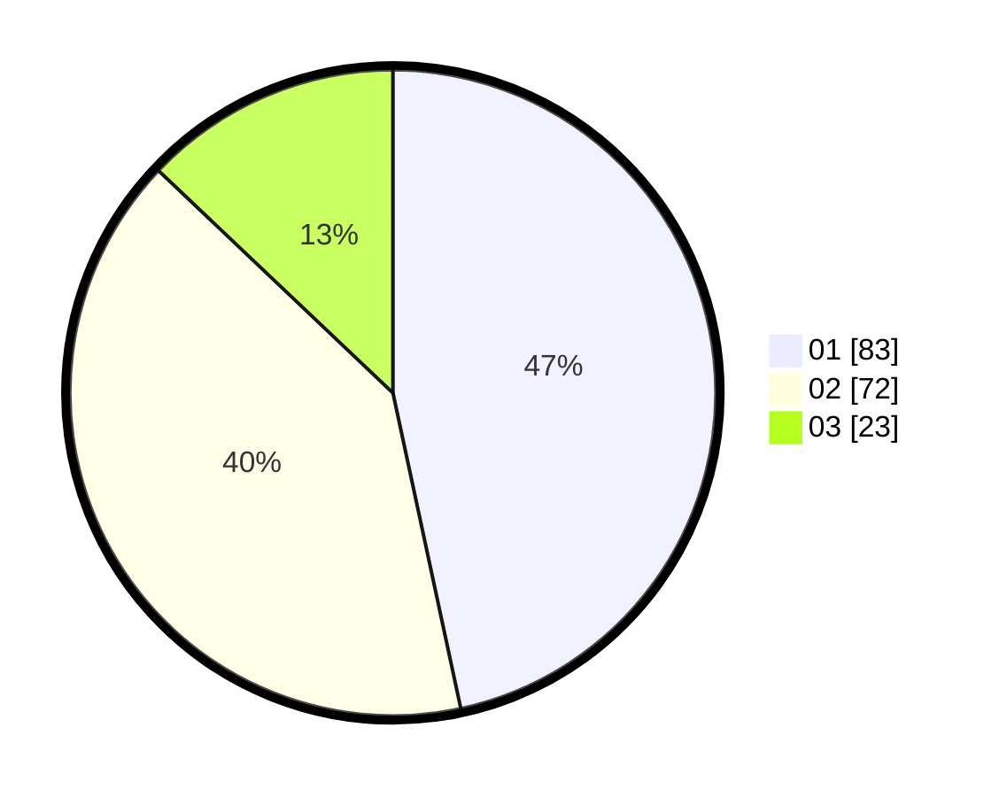

# Hasil

Hasil perolehan suara paslon dapat dilihat pada file paslon-01.txt, paslon-02.txt, dan paslon-03.txt.

Jika tidak ada, artinya data tersebut belum ada pada SIREKAP.

## Perolehan Suara

 * Paslon 01: **83**.
 * Paslon 02: **72**.
 * Paslon 03: **23**.

## Foto C Plano

https://sirekap-obj-formc.kpu.go.id/ec6f/pemilu/ppwp/31/75/04/10/02/3175041002031-20240216-011726--250fe896-68e7-443e-a7da-8ccd9f30ba49.jpg

https://sirekap-obj-formc.kpu.go.id/ec6f/pemilu/ppwp/31/75/04/10/02/3175041002031-20240216-011830--5cbf7115-eb20-4457-84da-63c0eccb294b.jpg

https://sirekap-obj-formc.kpu.go.id/ec6f/pemilu/ppwp/31/75/04/10/02/3175041002031-20240216-011917--0ae2d77a-2a7f-4783-96d3-e45ca4ade022.jpg

## DATA PEMILIH TETAP

Jumlah pemilih dalam DPT: **260**.
 * L: **125**.
 * P: **135**.

## DATA PENGGUNA HAK PILIH

Jumlah pengguna hak pilih dalam DPT: **184**.
 * L: **82**.
 * P: **102**.

Jumlah pengguna hak pilih dalam DPTb: **0**.
 * L: **0**.
 * P: **0**.

Jumlah pengguna hak pilih dalam DPK: **0**.
 * L: **0**.
 * P: **0**.

Jumlah pengguna hak pilih: **184**.
 * L: **82**.
 * P: **102**.

## JUMLAH SUARA SAH DAN TIDAK SAH

JUMLAH SELURUH SUARA SAH: **178**.

JUMLAH SUARA TIDAK SAH: **6**.

JUMLAH SELURUH SUARA SAH DAN SUARA TIDAK SAH: **184**.
