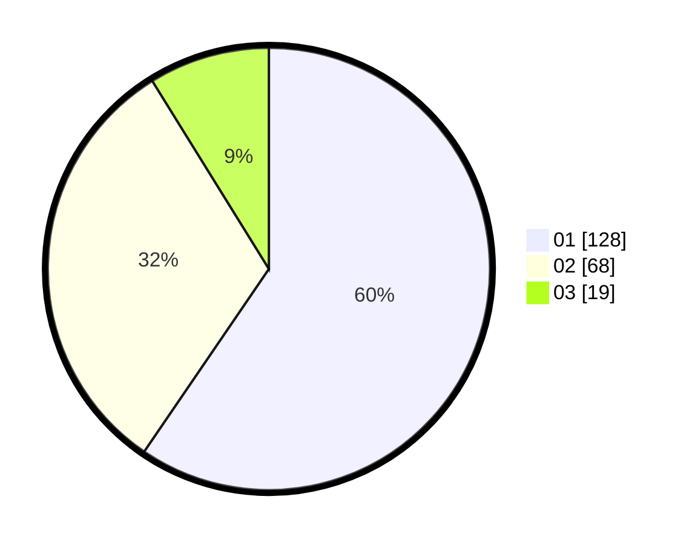

# Hasil

Hasil perolehan suara paslon dapat dilihat pada file paslon-01.txt, paslon-02.txt, dan paslon-03.txt.

Jika tidak ada, artinya data tersebut belum ada pada SIREKAP.

## Perolehan Suara

 * Paslon 01: **128**.
 * Paslon 02: **68**.
 * Paslon 03: **19**.

## Foto C Plano

https://sirekap-obj-formc.kpu.go.id/b891/pemilu/ppwp/31/75/04/10/02/3175041002032-20240217-015941--9f56318e-4bf9-4b2d-98ea-3d37e3fba993.jpg

https://sirekap-obj-formc.kpu.go.id/b891/pemilu/ppwp/31/75/04/10/02/3175041002032-20240217-020625--e73288d6-4849-4a28-88bc-44aa3003c997.jpg

https://sirekap-obj-formc.kpu.go.id/b891/pemilu/ppwp/31/75/04/10/02/3175041002032-20240217-020911--ad3823c2-4192-4604-9692-43a9a9dae765.jpg

## DATA PEMILIH TETAP

Jumlah pemilih dalam DPT: **265**.
 * L: **138**.
 * P: **127**.

## DATA PENGGUNA HAK PILIH

Jumlah pengguna hak pilih dalam DPT: **217**.
 * L: **110**.
 * P: **107**.

Jumlah pengguna hak pilih dalam DPTb: **0**.
 * L: **0**.
 * P: **0**.

Jumlah pengguna hak pilih dalam DPK: **0**.
 * L: **0**.
 * P: **0**.

Jumlah pengguna hak pilih: **217**.
 * L: **110**.
 * P: **107**.

## JUMLAH SUARA SAH DAN TIDAK SAH

JUMLAH SELURUH SUARA SAH: **215**.

JUMLAH SUARA TIDAK SAH: **2**.

JUMLAH SELURUH SUARA SAH DAN SUARA TIDAK SAH: **217**.
