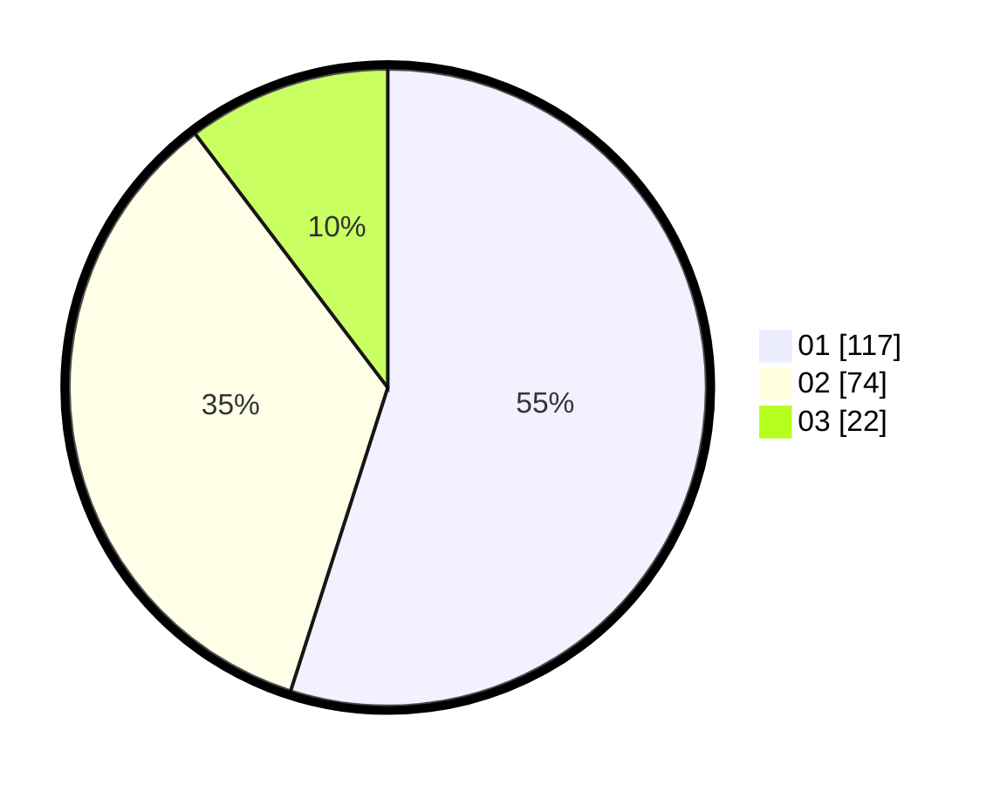

# Hasil

Hasil perolehan suara paslon dapat dilihat pada file paslon-01.txt, paslon-02.txt, dan paslon-03.txt.

Jika tidak ada, artinya data tersebut belum ada pada SIREKAP.

## Perolehan Suara

 * Paslon 01: **117**.
 * Paslon 02: **74**.
 * Paslon 03: **22**.

## Foto C Plano

https://sirekap-obj-formc.kpu.go.id/951f/pemilu/ppwp/31/75/04/10/02/3175041002036-20240216-142000--ed4cc0ed-757c-4278-bf39-e1179a844ce9.jpg

https://sirekap-obj-formc.kpu.go.id/951f/pemilu/ppwp/31/75/04/10/02/3175041002036-20240216-154129--01ec560d-ac2f-429a-be63-c0dcfdd0977a.jpg

https://sirekap-obj-formc.kpu.go.id/951f/pemilu/ppwp/31/75/04/10/02/3175041002036-20240216-142321--66f36388-6cd2-44e7-ba98-1d8fceb4a9fd.jpg

## DATA PEMILIH TETAP

Jumlah pemilih dalam DPT: **283**.
 * L: **122**.
 * P: **161**.

## DATA PENGGUNA HAK PILIH

Jumlah pengguna hak pilih dalam DPT: **209**.
 * L: **84**.
 * P: **125**.

Jumlah pengguna hak pilih dalam DPTb: **9**.
 * L: **0**.
 * P: **9**.

Jumlah pengguna hak pilih dalam DPK: **0**.
 * L: **0**.
 * P: **0**.

Jumlah pengguna hak pilih: **218**.
 * L: **84**.
 * P: **134**.

## JUMLAH SUARA SAH DAN TIDAK SAH

JUMLAH SELURUH SUARA SAH: **213**.

JUMLAH SUARA TIDAK SAH: **5**.

JUMLAH SELURUH SUARA SAH DAN SUARA TIDAK SAH: **218**.
