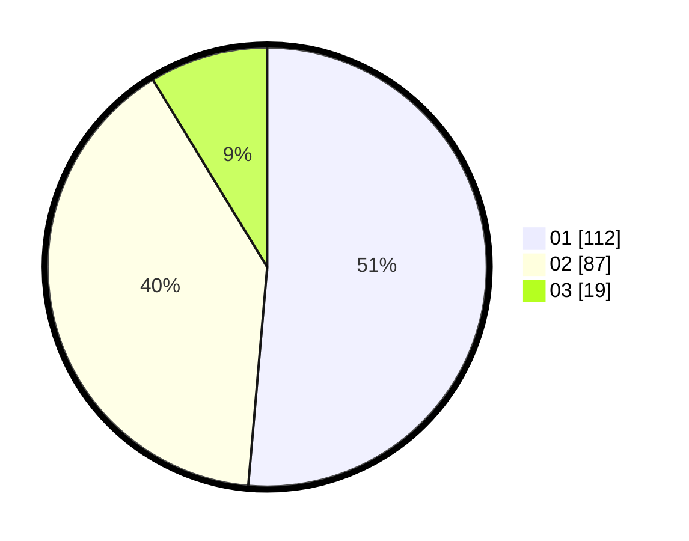

# Hasil

Hasil perolehan suara paslon dapat dilihat pada file paslon-01.txt, paslon-02.txt, dan paslon-03.txt.

Jika tidak ada, artinya data tersebut belum ada pada SIREKAP.

## Perolehan Suara

 * Paslon 01: **112**.
 * Paslon 02: **87**.
 * Paslon 03: **19**.

## Foto C Plano

https://sirekap-obj-formc.kpu.go.id/85a0/pemilu/ppwp/31/75/04/10/02/3175041002050-20240216-180515--da780c3b-c67b-466a-b6da-7e36b0e86b72.jpg

https://sirekap-obj-formc.kpu.go.id/85a0/pemilu/ppwp/31/75/04/10/02/3175041002050-20240216-181614--5209ae03-3375-49ea-ab8c-3148dffcb6ef.jpg

https://sirekap-obj-formc.kpu.go.id/85a0/pemilu/ppwp/31/75/04/10/02/3175041002050-20240216-184258--de2835c3-a8ba-45cb-97f2-ab4b86b5baf0.jpg

## DATA PEMILIH TETAP

Jumlah pemilih dalam DPT: **261**.
 * L: **130**.
 * P: **131**.

## DATA PENGGUNA HAK PILIH

Jumlah pengguna hak pilih dalam DPT: **214**.
 * L: **108**.
 * P: **106**.

Jumlah pengguna hak pilih dalam DPTb: **0**.
 * L: **0**.
 * P: **0**.

Jumlah pengguna hak pilih dalam DPK: **9**.
 * L: **2**.
 * P: **7**.

Jumlah pengguna hak pilih: **223**.
 * L: **110**.
 * P: **113**.

## JUMLAH SUARA SAH DAN TIDAK SAH

JUMLAH SELURUH SUARA SAH: **218**.

JUMLAH SUARA TIDAK SAH: **5**.

JUMLAH SELURUH SUARA SAH DAN SUARA TIDAK SAH: **223**.
