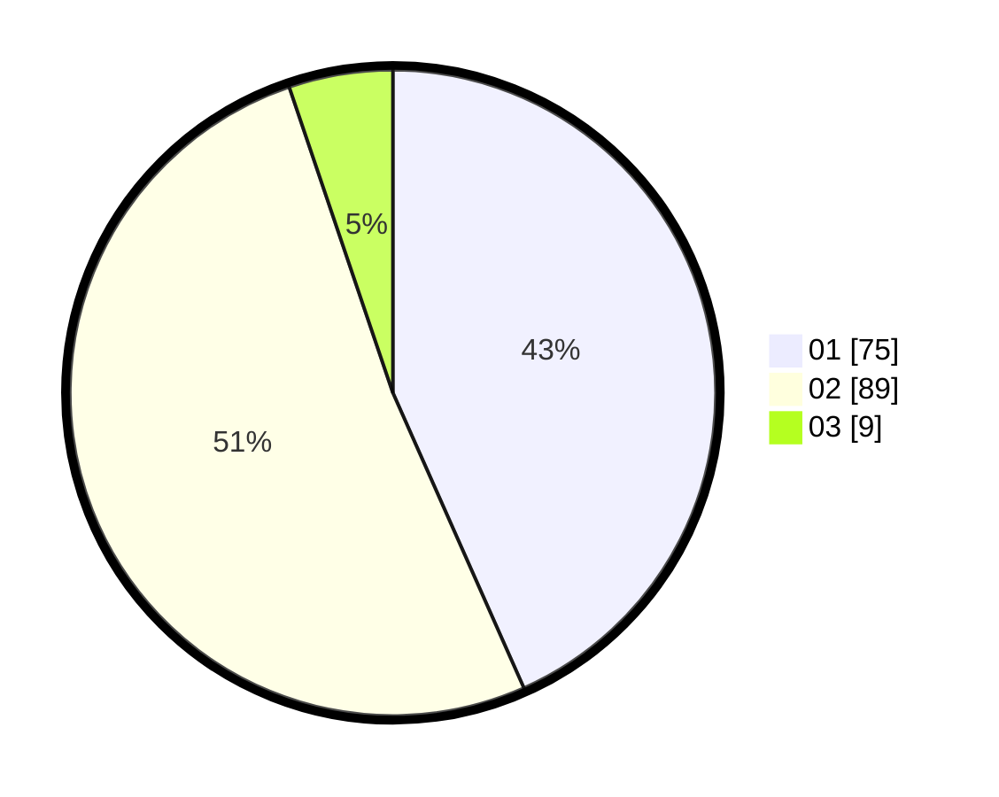

# Hasil

Hasil perolehan suara paslon dapat dilihat pada file paslon-01.txt, paslon-02.txt, dan paslon-03.txt.

Jika tidak ada, artinya data tersebut belum ada pada SIREKAP.

## Perolehan Suara

 * Paslon 01: **75**.
 * Paslon 02: **89**.
 * Paslon 03: **9**.

## Foto C Plano

https://sirekap-obj-formc.kpu.go.id/6a07/pemilu/ppwp/31/75/04/10/02/3175041002051-20240214-203949--3b1a64fb-bd78-42bf-af8b-175e0114712a.jpg

https://sirekap-obj-formc.kpu.go.id/6a07/pemilu/ppwp/31/75/04/10/02/3175041002051-20240217-030808--548e1128-68bc-46ef-843c-c8130627f37f.jpg

https://sirekap-obj-formc.kpu.go.id/6a07/pemilu/ppwp/31/75/04/10/02/3175041002051-20240214-212206--e28bd67e-41e6-45ca-950f-488f9bde1668.jpg

## DATA PEMILIH TETAP

Jumlah pemilih dalam DPT: **269**.
 * L: **141**.
 * P: **128**.

## DATA PENGGUNA HAK PILIH

Jumlah pengguna hak pilih dalam DPT: **178**.
 * L: **87**.
 * P: **91**.

Jumlah pengguna hak pilih dalam DPTb: **0**.
 * L: **0**.
 * P: **0**.

Jumlah pengguna hak pilih dalam DPK: **1**.
 * L: **0**.
 * P: **1**.

Jumlah pengguna hak pilih: **179**.
 * L: **87**.
 * P: **92**.

## JUMLAH SUARA SAH DAN TIDAK SAH

JUMLAH SELURUH SUARA SAH: **176**.

JUMLAH SUARA TIDAK SAH: **3**.

JUMLAH SELURUH SUARA SAH DAN SUARA TIDAK SAH: **179**.
