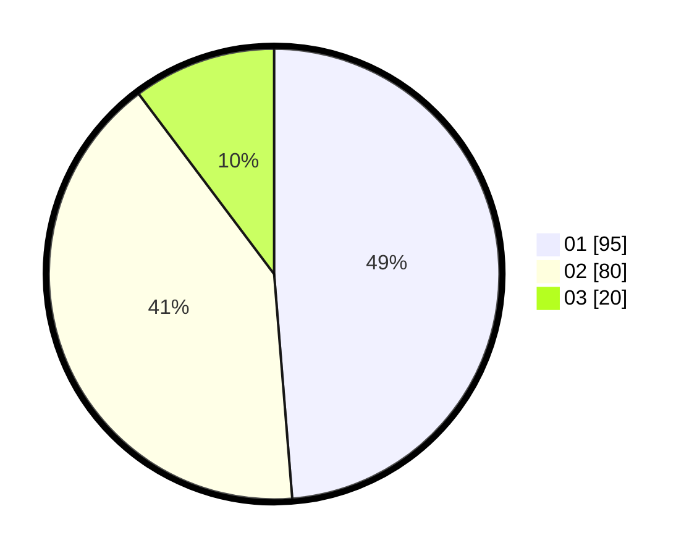

# Hasil

Hasil perolehan suara paslon dapat dilihat pada file paslon-01.txt, paslon-02.txt, dan paslon-03.txt.

Jika tidak ada, artinya data tersebut belum ada pada SIREKAP.

## Perolehan Suara

 * Paslon 01: **95**.
 * Paslon 02: **80**.
 * Paslon 03: **20**.

## Foto C Plano

https://sirekap-obj-formc.kpu.go.id/e11a/pemilu/ppwp/31/75/04/10/02/3175041002052-20240216-150855--2e465f23-1c01-4c6f-8cbe-77b6819104ac.jpg

https://sirekap-obj-formc.kpu.go.id/e11a/pemilu/ppwp/31/75/04/10/02/3175041002052-20240216-151001--e2a42d91-201c-45a1-a31d-05bd6cd2637d.jpg

https://sirekap-obj-formc.kpu.go.id/e11a/pemilu/ppwp/31/75/04/10/02/3175041002052-20240216-151025--c7bf4e48-88bd-40b7-ba76-2c0fb4b78a9c.jpg

## DATA PEMILIH TETAP

Jumlah pemilih dalam DPT: **266**.
 * L: **146**.
 * P: **120**.

## DATA PENGGUNA HAK PILIH

Jumlah pengguna hak pilih dalam DPT: **203**.
 * L: **104**.
 * P: **99**.

Jumlah pengguna hak pilih dalam DPTb: **0**.
 * L: **0**.
 * P: **0**.

Jumlah pengguna hak pilih dalam DPK: **1**.
 * L: **0**.
 * P: **1**.

Jumlah pengguna hak pilih: **204**.
 * L: **104**.
 * P: **100**.

## JUMLAH SUARA SAH DAN TIDAK SAH

JUMLAH SELURUH SUARA SAH: **195**.

JUMLAH SUARA TIDAK SAH: **9**.

JUMLAH SELURUH SUARA SAH DAN SUARA TIDAK SAH: **204**.
