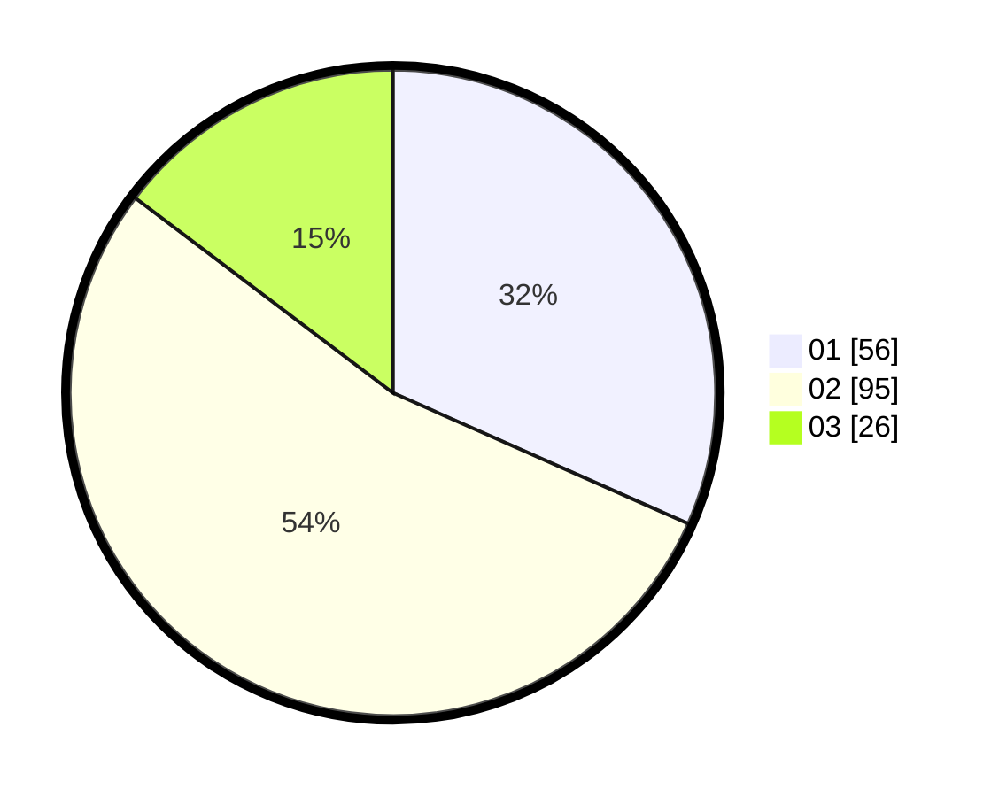

# Hasil

Hasil perolehan suara paslon dapat dilihat pada file paslon-01.txt, paslon-02.txt, dan paslon-03.txt.

Jika tidak ada, artinya data tersebut belum ada pada SIREKAP.

## Perolehan Suara

 * Paslon 01: **56**.
 * Paslon 02: **95**.
 * Paslon 03: **26**.

## Foto C Plano

https://sirekap-obj-formc.kpu.go.id/3b60/pemilu/ppwp/31/75/04/10/02/3175041002071-20240216-083305--8255ed4f-cbb6-4e9b-99d8-f6ac74ce7d8c.jpg

https://sirekap-obj-formc.kpu.go.id/3b60/pemilu/ppwp/31/75/04/10/02/3175041002071-20240216-083729--18a42b3f-7cd7-4b13-a72d-641a01664426.jpg

https://sirekap-obj-formc.kpu.go.id/3b60/pemilu/ppwp/31/75/04/10/02/3175041002071-20240216-084201--3ebfbf04-f69e-492c-b23d-01d82558dd98.jpg

## DATA PEMILIH TETAP

Jumlah pemilih dalam DPT: **264**.
 * L: **139**.
 * P: **125**.

## DATA PENGGUNA HAK PILIH

Jumlah pengguna hak pilih dalam DPT: **182**.
 * L: **87**.
 * P: **95**.

Jumlah pengguna hak pilih dalam DPTb: **1**.
 * L: **0**.
 * P: **1**.

Jumlah pengguna hak pilih dalam DPK: **0**.
 * L: **0**.
 * P: **0**.

Jumlah pengguna hak pilih: **183**.
 * L: **87**.
 * P: **96**.

## JUMLAH SUARA SAH DAN TIDAK SAH

JUMLAH SELURUH SUARA SAH: **177**.

JUMLAH SUARA TIDAK SAH: **6**.

JUMLAH SELURUH SUARA SAH DAN SUARA TIDAK SAH: **183**.
